# Lithic Enterprise Healthcare Platform v0.5 - Murder Board Analysis

## Executive Summary

This document provides a comprehensive gap analysis ("murder board") of the Lithic Healthcare Platform, identifying critical gaps, missing functionality, and areas requiring enhancement to compete with Epic Systems. Each gap is categorized by severity, impact, and recommended remediation.

---

## System Architecture Overview

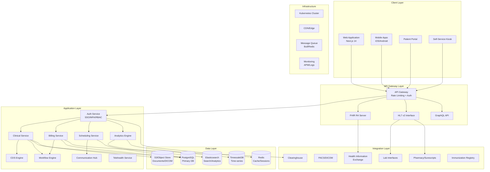

---

## User Journey Maps

### 1. Patient Registration & Intake Flow

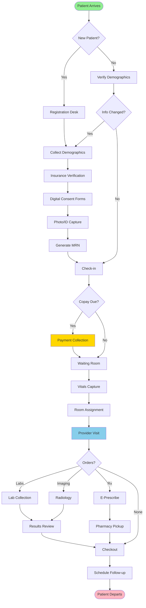

### 2. Clinical Documentation Workflow

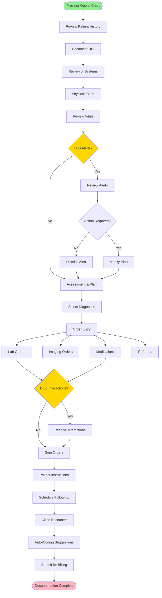

### 3. Revenue Cycle Management Flow

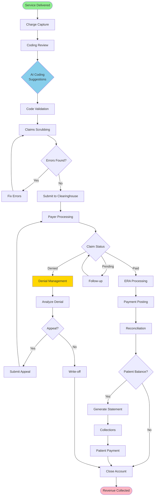

### 4. Laboratory Workflow

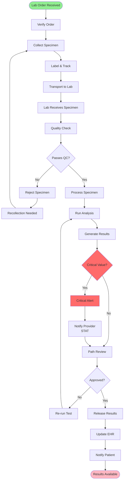

### 5. Telehealth Session Flow

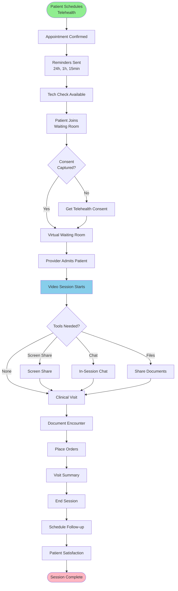

### 6. Population Health Management Flow

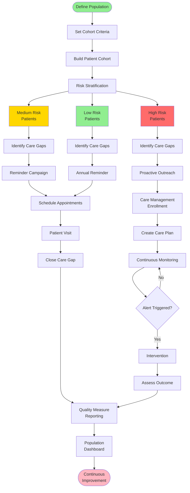

---

## Gap Analysis - Murder Board

### CRITICAL GAPS (Severity: HIGH - Must Fix)

#### GAP-001: Mobile Application Platform
| Aspect | Details |
|--------|---------|
| **Current State** | Web-only application with responsive design |
| **Gap** | No native iOS/Android mobile applications |
| **Impact** | 60% of healthcare workers need mobile access for rounds, field visits |
| **Epic Comparison** | Epic Haiku (iOS) and Canto (Android) are industry standard |
| **Remediation** | Build React Native mobile apps with offline sync |
| **Priority** | P0 - Critical |
| **Effort** | Large |

#### GAP-002: Advanced AI/ML Integration
| Aspect | Details |
|--------|---------|
| **Current State** | Basic predictive models for readmission, no-show |
| **Gap** | No LLM integration, limited NLP for clinical notes |
| **Impact** | Missing ambient documentation, intelligent summarization |
| **Epic Comparison** | Epic integrating GPT-4, Nuance DAX |
| **Remediation** | Integrate LLM APIs for clinical documentation, summarization |
| **Priority** | P0 - Critical |
| **Effort** | Large |

#### GAP-003: Offline Capability
| Aspect | Details |
|--------|---------|
| **Current State** | Requires constant connectivity |
| **Gap** | No offline mode for disconnected scenarios |
| **Impact** | Home health, rural areas, disaster response unusable |
| **Epic Comparison** | Epic supports offline with sync |
| **Remediation** | Implement PWA with IndexedDB, sync queue |
| **Priority** | P0 - Critical |
| **Effort** | Large |

#### GAP-004: Voice Interface & Ambient Documentation
| Aspect | Details |
|--------|---------|
| **Current State** | No voice capabilities |
| **Gap** | No voice commands, dictation, or ambient listening |
| **Impact** | Providers spend 50%+ time on documentation |
| **Epic Comparison** | Epic + Nuance DAX for ambient clinical intelligence |
| **Remediation** | Integrate speech-to-text, voice commands, ambient AI |
| **Priority** | P0 - Critical |
| **Effort** | Large |

#### GAP-005: Remote Patient Monitoring (RPM)
| Aspect | Details |
|--------|---------|
| **Current State** | Basic telehealth only |
| **Gap** | No IoT device integration, wearables, home monitoring |
| **Impact** | Missing chronic care management revenue ($$$) |
| **Epic Comparison** | Epic MyChart integrates Apple Health, Fitbit, etc. |
| **Remediation** | Build RPM platform with device integrations |
| **Priority** | P0 - Critical |
| **Effort** | Large |

### HIGH PRIORITY GAPS (Severity: HIGH)

#### GAP-006: Patient Engagement Platform
| Aspect | Details |
|--------|---------|
| **Current State** | Basic patient portal |
| **Gap** | No gamification, health goals, wellness programs |
| **Impact** | Low patient engagement and retention |
| **Remediation** | Build comprehensive engagement features |
| **Priority** | P1 - High |
| **Effort** | Medium |

#### GAP-007: Social Determinants of Health (SDOH)
| Aspect | Details |
|--------|---------|
| **Current State** | Basic social history in demographics |
| **Gap** | No SDOH screening, Z-codes, community resources |
| **Impact** | Missing value-based care requirements |
| **Remediation** | Implement SDOH screening tools, resource referrals |
| **Priority** | P1 - High |
| **Effort** | Medium |

#### GAP-008: Clinical Trials & Research
| Aspect | Details |
|--------|---------|
| **Current State** | No research capabilities |
| **Gap** | No clinical trials management, research data capture |
| **Impact** | Cannot serve academic medical centers |
| **Remediation** | Build research module with REDCap-like features |
| **Priority** | P1 - High |
| **Effort** | Large |

#### GAP-009: Genomics & Precision Medicine
| Aspect | Details |
|--------|---------|
| **Current State** | No genomics support |
| **Gap** | No genetic testing integration, pharmacogenomics |
| **Impact** | Missing precision medicine capabilities |
| **Remediation** | Integrate genomics data, PGx decision support |
| **Priority** | P1 - High |
| **Effort** | Large |

#### GAP-010: Internationalization (i18n)
| Aspect | Details |
|--------|---------|
| **Current State** | English only |
| **Gap** | No multi-language support, localization |
| **Impact** | Cannot serve diverse populations, global markets |
| **Remediation** | Implement i18n framework, translate UI |
| **Priority** | P1 - High |
| **Effort** | Medium |

### MEDIUM PRIORITY GAPS (Severity: MEDIUM)

#### GAP-011: Advanced Report Distribution
| Aspect | Details |
|--------|---------|
| **Current State** | Basic report generation and export |
| **Gap** | No scheduled delivery, subscriptions, bursting |
| **Impact** | Manual effort for recurring reports |
| **Remediation** | Build report scheduling and distribution |
| **Priority** | P2 - Medium |
| **Effort** | Small |

#### GAP-012: Bulk Operations Interface
| Aspect | Details |
|--------|---------|
| **Current State** | Single record operations |
| **Gap** | No bulk import/export, mass updates |
| **Impact** | Inefficient for large data migrations |
| **Remediation** | Build bulk operations UI with job tracking |
| **Priority** | P2 - Medium |
| **Effort** | Medium |

#### GAP-013: Integration Marketplace
| Aspect | Details |
|--------|---------|
| **Current State** | Manual integrations |
| **Gap** | No app store, plugin architecture |
| **Impact** | Cannot leverage third-party innovations |
| **Remediation** | Build marketplace with SDK |
| **Priority** | P2 - Medium |
| **Effort** | Large |

#### GAP-014: Digital Signature Integration
| Aspect | Details |
|--------|---------|
| **Current State** | Basic consent checkboxes |
| **Gap** | No DocuSign/Adobe Sign integration |
| **Impact** | Paper consent forms still needed |
| **Remediation** | Integrate e-signature providers |
| **Priority** | P2 - Medium |
| **Effort** | Small |

#### GAP-015: Advanced Consent Management
| Aspect | Details |
|--------|---------|
| **Current State** | Basic consent tracking |
| **Gap** | No granular consent, opt-in/opt-out, HIPAA authorization |
| **Impact** | Compliance risk, patient trust |
| **Remediation** | Build comprehensive consent management |
| **Priority** | P2 - Medium |
| **Effort** | Medium |

#### GAP-016: Document Management System
| Aspect | Details |
|--------|---------|
| **Current State** | Basic document upload/download |
| **Gap** | No versioning, OCR, intelligent routing |
| **Impact** | Manual document handling |
| **Remediation** | Build enterprise document management |
| **Priority** | P2 - Medium |
| **Effort** | Medium |

#### GAP-017: In-App Help & Training
| Aspect | Details |
|--------|---------|
| **Current State** | External documentation only |
| **Gap** | No contextual help, tutorials, walkthroughs |
| **Impact** | High training costs, support tickets |
| **Remediation** | Build in-app help system |
| **Priority** | P2 - Medium |
| **Effort** | Small |

#### GAP-018: Unified Notification Hub
| Aspect | Details |
|--------|---------|
| **Current State** | Fragmented notifications across modules |
| **Gap** | No unified notification center, preferences |
| **Impact** | Alert fatigue, missed critical notifications |
| **Remediation** | Build centralized notification hub |
| **Priority** | P2 - Medium |
| **Effort** | Medium |

#### GAP-019: Advanced Audit & Forensics
| Aspect | Details |
|--------|---------|
| **Current State** | Basic audit logging |
| **Gap** | No forensic analysis, anomaly detection |
| **Impact** | Limited breach investigation capability |
| **Remediation** | Build advanced audit analytics |
| **Priority** | P2 - Medium |
| **Effort** | Medium |

#### GAP-020: Disaster Recovery UI
| Aspect | Details |
|--------|---------|
| **Current State** | No DR features exposed |
| **Gap** | No backup status, failover controls, DR dashboard |
| **Impact** | Ops team cannot manage DR easily |
| **Remediation** | Build DR management dashboard |
| **Priority** | P2 - Medium |
| **Effort** | Small |

---

## Stakeholder Experience Matrix

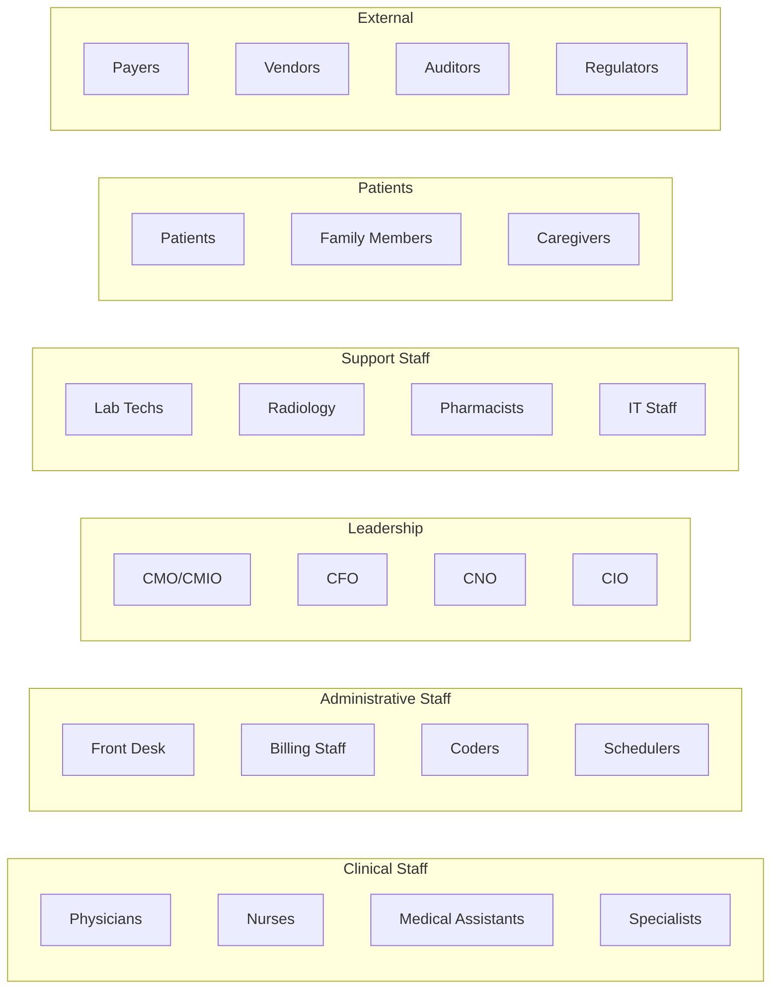

### Stakeholder Needs vs. Current Capabilities

| Stakeholder | Critical Needs | Current State | Gap Level |
|-------------|---------------|---------------|-----------|
| **Physicians** | Quick documentation, voice input, mobile access | Web-only, manual entry | HIGH |
| **Nurses** | Bedside charting, medication scanning, alerts | Desktop workflows | MEDIUM |
| **Medical Assistants** | Intake workflows, vitals entry, tasking | Good coverage | LOW |
| **Specialists** | Specialty templates, referral mgmt | Basic templates | MEDIUM |
| **Front Desk** | Quick registration, eligibility, payments | Good coverage | LOW |
| **Billing Staff** | Claims mgmt, denial tracking, reports | Good coverage | LOW |
| **Coders** | AI suggestions, productivity tools | Basic AI | MEDIUM |
| **Schedulers** | Multi-resource scheduling, optimization | Good coverage | LOW |
| **CMO/CMIO** | Quality dashboards, clinical analytics | Good coverage | LOW |
| **CFO** | Revenue analytics, forecasting | Good coverage | LOW |
| **CNO** | Nursing metrics, staffing analytics | Basic | MEDIUM |
| **CIO** | Integration mgmt, security dashboards | Good coverage | LOW |
| **Lab Techs** | Specimen tracking, QC workflows | Good coverage | LOW |
| **Radiology** | DICOM viewing, reporting | Good coverage | LOW |
| **Pharmacists** | Interaction checking, inventory | Good coverage | LOW |
| **IT Staff** | System admin, monitoring | Basic monitoring | MEDIUM |
| **Patients** | Mobile access, engagement, RPM | Web portal only | HIGH |
| **Family** | Proxy access, communication | Limited | MEDIUM |
| **Caregivers** | Care coordination, updates | Limited | MEDIUM |
| **Payers** | Claims data, prior auth | Good coverage | LOW |
| **Auditors** | Audit reports, compliance | Basic | MEDIUM |

---

## System Integration Architecture

```mermaid
flowchart TB
    subgraph "Lithic Core Platform"
        CORE[Lithic EHR Core]
        FHIR_API[FHIR R4 API]
        HL7_IF[HL7 v2 Interface]
        REST_API[REST API]
        WEBHOOK[Webhook Engine]
    end

    subgraph "Clinical Integrations"
        LIS[Lab Information<br/>Systems]
        RIS[Radiology Info<br/>Systems]
        PACS_INT[PACS/DICOM<br/>Archives]
        CARDIO[Cardiology<br/>Systems]
        PATH[Pathology<br/>Systems]
    end

    subgraph "Financial Integrations"
        CLEAR[Clearinghouses<br/>Change/Availity]
        PAYER_INT[Payer Portals]
        MERCHANT[Payment<br/>Processors]
        GL[General Ledger<br/>ERP Systems]
    end

    subgraph "Pharmacy Integrations"
        SURE[Surescripts<br/>e-Prescribing]
        PDMP[PDMP<br/>State Registries]
        FORMULARY[Formulary<br/>Databases]
        NCPDP[NCPDP<br/>Transactions]
    end

    subgraph "Exchange Networks"
        CQ[Carequality]
        CW[CommonWell]
        DIRECT[Direct<br/>Secure Messaging]
        STATE_HIE[State HIE<br/>Networks]
    end

    subgraph "Identity & Access"
        OKTA[Okta/Auth0]
        AZURE_AD[Azure AD/Entra]
        LDAP_INT[LDAP/Active<br/>Directory]
        SMART[SMART on FHIR<br/>Apps]
    end

    subgraph "External Services"
        TWILIO_INT[Twilio<br/>SMS/Voice]
        STRIPE_INT[Stripe<br/>Payments]
        AWS_INT[AWS Services<br/>S3/SES]
        NUANCE[Nuance/Dragon<br/>Voice]
    end

    CORE --> FHIR_API
    CORE --> HL7_IF
    CORE --> REST_API
    CORE --> WEBHOOK

    HL7_IF --> LIS
    HL7_IF --> RIS
    FHIR_API --> PACS_INT
    HL7_IF --> CARDIO
    HL7_IF --> PATH

    REST_API --> CLEAR
    REST_API --> PAYER_INT
    REST_API --> MERCHANT
    REST_API --> GL

    HL7_IF --> SURE
    REST_API --> PDMP
    REST_API --> FORMULARY
    HL7_IF --> NCPDP

    FHIR_API --> CQ
    FHIR_API --> CW
    REST_API --> DIRECT
    FHIR_API --> STATE_HIE

    REST_API --> OKTA
    REST_API --> AZURE_AD
    REST_API --> LDAP_INT
    FHIR_API --> SMART

    REST_API --> TWILIO_INT
    REST_API --> STRIPE_INT
    REST_API --> AWS_INT
    REST_API --> NUANCE
```

---

## Data Flow Diagrams

### Patient Data Flow

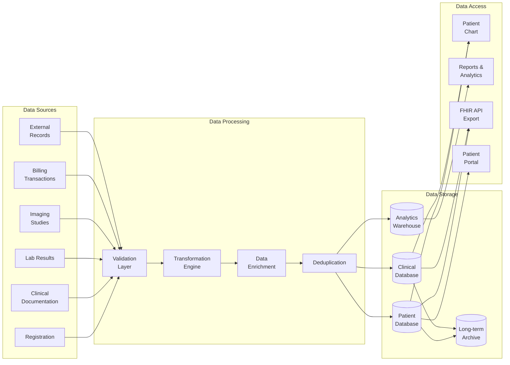

---

## Security Architecture

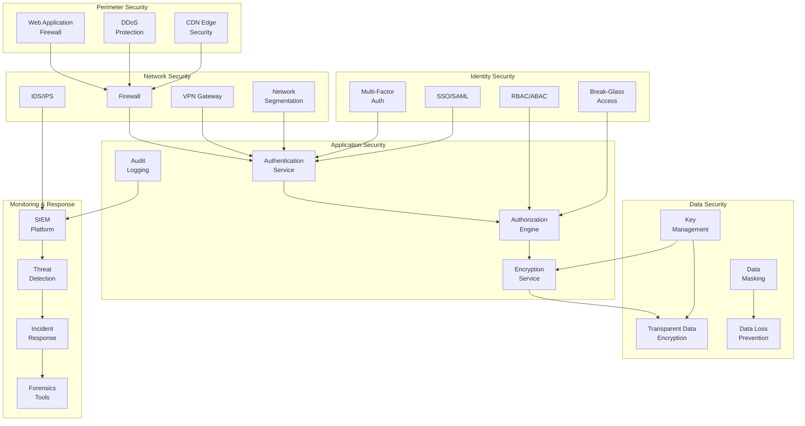

---

## v0.5 Feature Roadmap

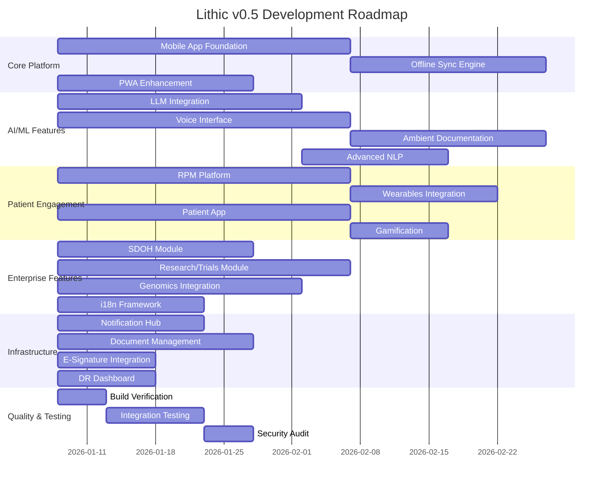

---

## Module Dependency Graph

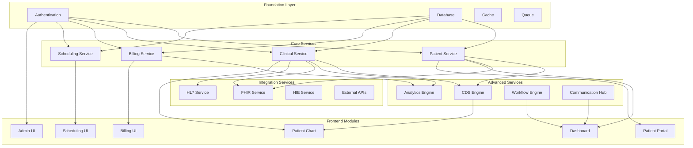

---

## Performance Benchmarks & Targets

| Metric | Current | Target v0.5 | Epic Benchmark |
|--------|---------|-------------|----------------|
| Page Load Time | 2.5s | <1.5s | 1.2s |
| API Response Time (p95) | 450ms | <200ms | 150ms |
| Search Response Time | 800ms | <300ms | 250ms |
| Concurrent Users | 500 | 2,000 | 10,000 |
| Database Queries/sec | 1,000 | 5,000 | 20,000 |
| Uptime SLA | 99.5% | 99.9% | 99.99% |
| Recovery Time Objective | 4 hours | 1 hour | 15 min |
| Recovery Point Objective | 1 hour | 15 min | 5 min |

---

## Risk Assessment Matrix

| Risk | Likelihood | Impact | Mitigation |
|------|------------|--------|------------|
| Security breach | Medium | Critical | Enhanced monitoring, penetration testing |
| Data loss | Low | Critical | Multi-region backup, DR testing |
| Performance degradation | Medium | High | Auto-scaling, caching optimization |
| Integration failures | Medium | High | Circuit breakers, fallback mechanisms |
| Compliance violation | Low | Critical | Regular audits, automated compliance checks |
| Vendor lock-in | Medium | Medium | Multi-cloud strategy, abstraction layers |
| Key person dependency | Medium | High | Documentation, cross-training |
| Scope creep | High | Medium | Strict change management |

---

## Recommendations Summary

### Immediate Actions (v0.5)
1. **Mobile Platform** - Launch React Native app foundation
2. **AI Integration** - Integrate LLM for documentation assistance
3. **Voice Interface** - Add speech-to-text capabilities
4. **RPM Platform** - Build remote patient monitoring
5. **Offline Mode** - Implement PWA with offline sync

### Short-term Actions (v0.6)
1. Patient engagement gamification
2. Research/clinical trials module
3. Genomics integration
4. Advanced analytics with ML
5. Integration marketplace

### Long-term Vision
1. Full Epic feature parity
2. Global market expansion (i18n)
3. AI-first documentation
4. Predictive care platform
5. Value-based care optimization

---

*Document Version: 0.5.0*
*Last Updated: 2026-01-08*
*Classification: Internal - Confidential*
