# Lithic Enterprise Healthcare Platform - System Architecture

**Version**: 0.4.0
**Date**: 2026-01-01
**Status**: Production

## Table of Contents

1. [Overview](#overview)
2. [System Architecture](#system-architecture)
3. [Module Architecture](#module-architecture)
4. [Data Flow](#data-flow)
5. [Security Architecture](#security-architecture)
6. [Integration Patterns](#integration-patterns)
7. [Deployment Architecture](#deployment-architecture)
8. [Performance & Scalability](#performance--scalability)

---

## Overview

Lithic is a comprehensive, enterprise-grade healthcare platform built on modern web technologies with a focus on modularity, scalability, and compliance. The platform follows a layered architecture pattern with clear separation of concerns.

### Core Principles

- **Modularity**: Independent, loosely-coupled modules
- **Scalability**: Horizontal scaling at all layers
- **Security**: Defense-in-depth approach
- **Compliance**: HIPAA, SOC 2, 21 CFR Part 11
- **Interoperability**: FHIR R4+, USCDI v3, HL7 v2
- **Performance**: Sub-second response times
- **Reliability**: 99.9% uptime target

---

## System Architecture

### High-Level Architecture

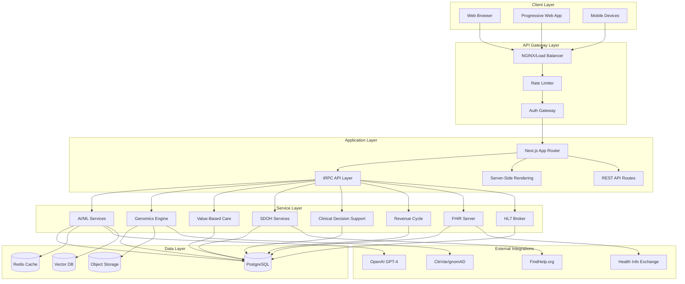
```mermaid
graph TB
    subgraph "Client Layer"
        WEB[Web Browser]
        PWA[Progressive Web App]
        MOBILE[Mobile Devices]
    end

    subgraph "API Gateway Layer"
        NGINX[NGINX/Load Balancer]
        RATE[Rate Limiter]
        AUTH[Auth Gateway]
    end

    subgraph "Application Layer"
        NEXT[Next.js App Router]
        TRPC[tRPC API Layer]
        SSR[Server-Side Rendering]
        API[REST API Routes]
    end

    subgraph "Service Layer"
        AI[AI/ML Services]
        GENOMICS[Genomics Engine]
        VBC[Value-Based Care]
        SDOH[SDOH Services]
        CDS[Clinical Decision Support]
        RCM[Revenue Cycle]
        FHIR[FHIR Server]
        HL7[HL7 Broker]
    end

    subgraph "Data Layer"
        POSTGRES[(PostgreSQL)]
        REDIS[(Redis Cache)]
        S3[(Object Storage)]
        VECTOR[(Vector DB)]
    end

    subgraph "External Integrations"
        OPENAI[OpenAI GPT-4]
        CLINVAR[ClinVar/gnomAD]
        FINDHELP[FindHelp.org]
        HIE[Health Info Exchange]
    end

    WEB --> NGINX
    PWA --> NGINX
    MOBILE --> NGINX
    NGINX --> RATE
    RATE --> AUTH
    AUTH --> NEXT
    NEXT --> TRPC
    NEXT --> SSR
    NEXT --> API

    TRPC --> AI
    TRPC --> GENOMICS
    TRPC --> VBC
    TRPC --> SDOH
    TRPC --> CDS
    TRPC --> RCM
    TRPC --> FHIR
    TRPC --> HL7

    AI --> POSTGRES
    AI --> REDIS
    AI --> OPENAI
    GENOMICS --> POSTGRES
    GENOMICS --> S3
    GENOMICS --> CLINVAR
    VBC --> POSTGRES
    SDOH --> POSTGRES
    SDOH --> FINDHELP
    CDS --> POSTGRES
    RCM --> POSTGRES
    FHIR --> POSTGRES
    FHIR --> HIE
    HL7 --> POSTGRES

    AI --> VECTOR
```

### Technology Stack

#### Frontend
- **Framework**: Next.js 14 with App Router
- **Language**: TypeScript (strict mode)
- **UI**: React 18, shadcn/ui, Radix UI
- **Styling**: TailwindCSS
- **State**: Zustand
- **Forms**: React Hook Form + Zod
- **Charts**: Recharts, D3.js

#### Backend
- **API**: tRPC (type-safe), REST
- **ORM**: Prisma
- **Database**: PostgreSQL 14+
- **Cache**: Redis 6+
- **Queue**: BullMQ
- **Search**: PostgreSQL full-text

#### AI/ML
- **LLM**: OpenAI GPT-4, GPT-4 Turbo
- **ML**: TensorFlow.js
- **NLP**: LangChain
- **Vector**: Pinecone/pgvector

#### Infrastructure
- **Containers**: Docker
- **Orchestration**: Kubernetes (recommended)
- **CDN**: CloudFront/Cloudflare
- **Storage**: S3-compatible object storage

---

## Module Architecture

### AI/ML Platform Architecture

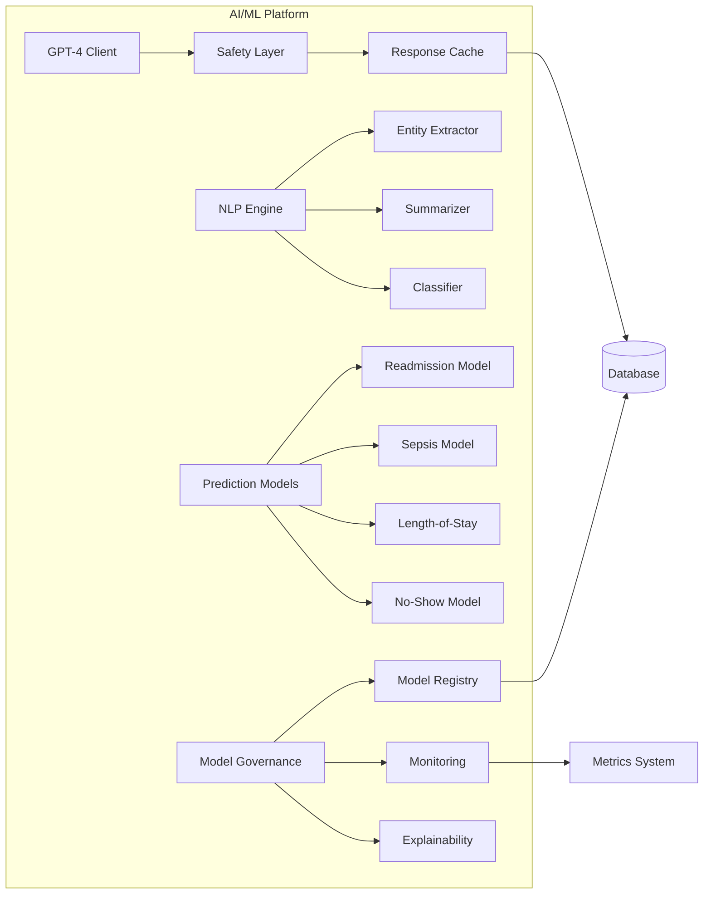
```mermaid
graph LR
    subgraph "AI/ML Platform"
        GPT[GPT-4 Client]
        NLP[NLP Engine]
        PRED[Prediction Models]
        GOV[Model Governance]

        GPT --> SAFETY[Safety Layer]
        SAFETY --> CACHE[Response Cache]

        NLP --> ENTITY[Entity Extractor]
        NLP --> SUMMARIZER[Summarizer]
        NLP --> CLASSIFIER[Classifier]

        PRED --> READMIT[Readmission Model]
        PRED --> SEPSIS[Sepsis Model]
        PRED --> LOS[Length-of-Stay]
        PRED --> NOSHOW[No-Show Model]

        GOV --> REGISTRY[Model Registry]
        GOV --> MONITOR[Monitoring]
        GOV --> EXPLAIN[Explainability]
    end

    CACHE --> DB[(Database)]
    REGISTRY --> DB
    MONITOR --> METRICS[Metrics System]
```

**Key Components**:
- **GPT-4 Client**: OpenAI API integration with retry logic
- **Safety Layer**: Content filtering, clinical validation, hallucination detection
- **NLP Engine**: Clinical text processing and entity extraction
- **Prediction Models**: ML models for clinical predictions
- **Model Governance**: Registry, versioning, monitoring, explainability

**Data Flow**:
1. User request → Safety layer validation
2. GPT-4 API call with streaming
3. Response filtering and validation
4. Cache storage for similar queries
5. Audit logging and monitoring

### Genomics Platform Architecture

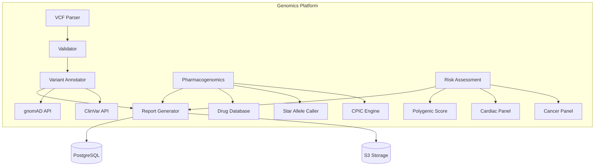
```mermaid
graph TB
    subgraph "Genomics Platform"
        VCF[VCF Parser]
        ANNOTATE[Variant Annotator]
        PGX[Pharmacogenomics]
        RISK[Risk Assessment]
        REPORT[Report Generator]

        VCF --> VALIDATE[Validator]
        VALIDATE --> ANNOTATE

        ANNOTATE --> CLINVAR[ClinVar API]
        ANNOTATE --> GNOMAD[gnomAD API]

        PGX --> CPIC[CPIC Engine]
        PGX --> STAR[Star Allele Caller]
        PGX --> DRUGDB[Drug Database]

        RISK --> CANCER[Cancer Panel]
        RISK --> CARDIAC[Cardiac Panel]
        RISK --> POLY[Polygenic Score]

        ANNOTATE --> REPORT
        PGX --> REPORT
        RISK --> REPORT
    end

    REPORT --> STORAGE[(S3 Storage)]
    REPORT --> DB[(PostgreSQL)]
```

**Key Components**:
- **VCF Parser**: Streaming parser for large VCF files
- **Variant Annotator**: ClinVar, gnomAD, dbSNP integration
- **Pharmacogenomics**: CPIC guideline implementation
- **Risk Assessment**: Multi-gene panels for disease risk
- **Report Generator**: Patient-friendly genomics reports

### SDOH Module Architecture

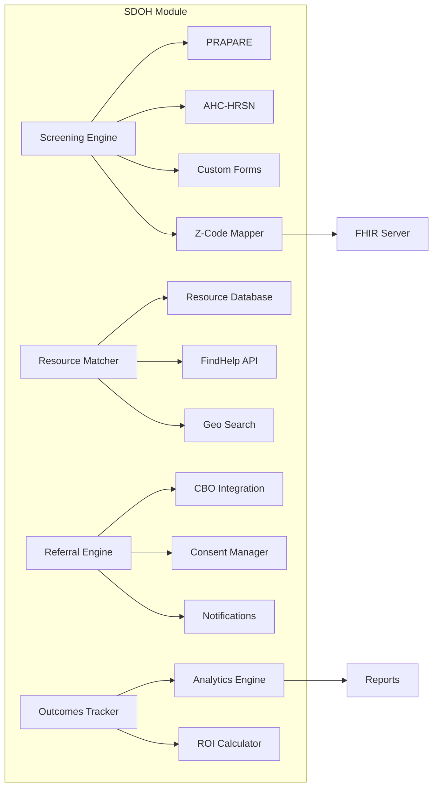
```mermaid
graph LR
    subgraph "SDOH Module"
        SCREEN[Screening Engine]
        RESOURCE[Resource Matcher]
        REFERRAL[Referral Engine]
        OUTCOME[Outcomes Tracker]

        SCREEN --> PRAPARE[PRAPARE]
        SCREEN --> AHC[AHC-HRSN]
        SCREEN --> CUSTOM[Custom Forms]
        SCREEN --> ZCODE[Z-Code Mapper]

        RESOURCE --> DB[Resource Database]
        RESOURCE --> FINDHELP[FindHelp API]
        RESOURCE --> GEO[Geo Search]

        REFERRAL --> CBO[CBO Integration]
        REFERRAL --> CONSENT[Consent Manager]
        REFERRAL --> NOTIFY[Notifications]

        OUTCOME --> ANALYTICS[Analytics Engine]
        OUTCOME --> ROI[ROI Calculator]
    end

    ZCODE --> FHIR[FHIR Server]
    ANALYTICS --> REPORTS[Reports]
```

**Key Components**:
- **Screening Engine**: PRAPARE, AHC-HRSN screening tools
- **Resource Matcher**: Geographic and need-based resource matching
- **Referral Engine**: Automated referral workflows with CBOs
- **Outcomes Tracker**: Social intervention tracking and ROI

### Value-Based Care Architecture

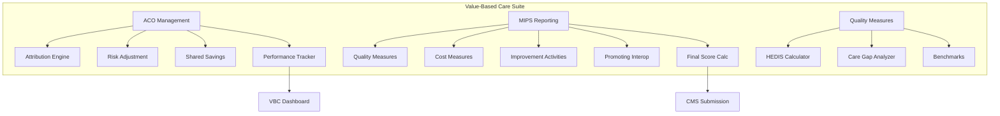
```mermaid
graph TB
    subgraph "Value-Based Care Suite"
        ACO[ACO Management]
        MIPS[MIPS Reporting]
        QUALITY[Quality Measures]

        ACO --> ATTR[Attribution Engine]
        ACO --> RISK[Risk Adjustment]
        ACO --> SAVINGS[Shared Savings]
        ACO --> PERF[Performance Tracker]

        MIPS --> QMEASURE[Quality Measures]
        MIPS --> COST[Cost Measures]
        MIPS --> IA[Improvement Activities]
        MIPS --> PI[Promoting Interop]
        MIPS --> SCORE[Final Score Calc]

        QUALITY --> HEDIS[HEDIS Calculator]
        QUALITY --> GAP[Care Gap Analyzer]
        QUALITY --> BENCH[Benchmarks]
    end

    PERF --> DASHBOARD[VBC Dashboard]
    SCORE --> CMS[CMS Submission]
```

**Key Components**:
- **ACO Management**: Patient attribution, risk adjustment, performance tracking
- **MIPS Reporting**: Complete MIPS score calculation and submission
- **Quality Measures**: HEDIS, care gaps, benchmarking

---

## Data Flow

### Clinical Data Flow

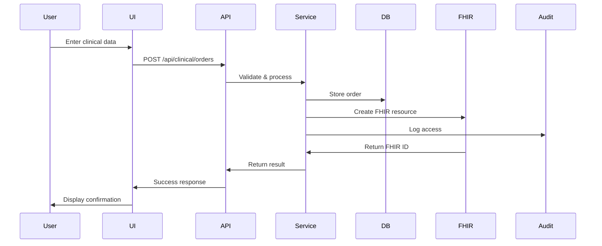
```mermaid
sequenceDiagram
    participant User
    participant UI
    participant API
    participant Service
    participant DB
    participant FHIR
    participant Audit

    User->>UI: Enter clinical data
    UI->>API: POST /api/clinical/orders
    API->>Service: Validate & process
    Service->>DB: Store order
    Service->>FHIR: Create FHIR resource
    Service->>Audit: Log access
    FHIR->>Service: Return FHIR ID
    Service->>API: Return result
    API->>UI: Success response
    UI->>User: Display confirmation
```

### AI/ML Prediction Flow

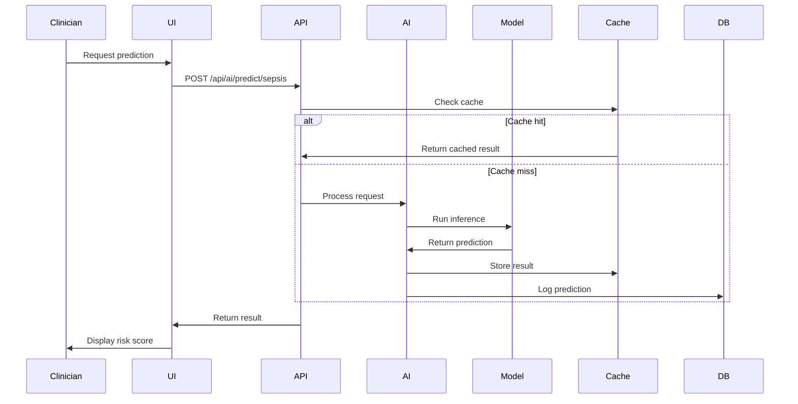
```mermaid
sequenceDiagram
    participant Clinician
    participant UI
    participant API
    participant AI
    participant Model
    participant Cache
    participant DB

    Clinician->>UI: Request prediction
    UI->>API: POST /api/ai/predict/sepsis
    API->>Cache: Check cache
    alt Cache hit
        Cache->>API: Return cached result
    else Cache miss
        API->>AI: Process request
        AI->>Model: Run inference
        Model->>AI: Return prediction
        AI->>Cache: Store result
        AI->>DB: Log prediction
    end
    API->>UI: Return result
    UI->>Clinician: Display risk score
```

### Genomics Processing Flow

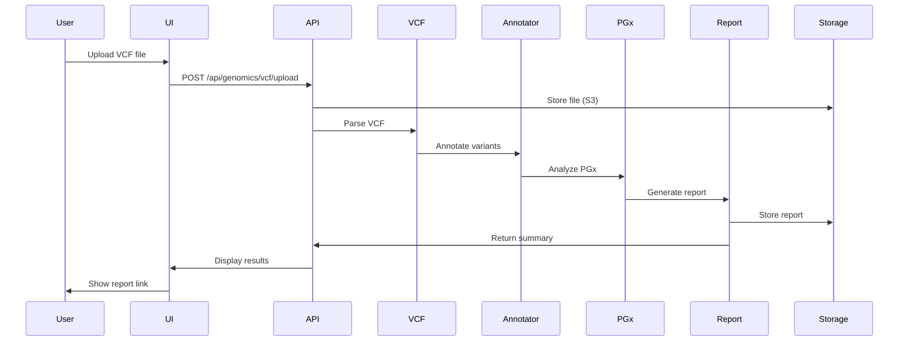
```mermaid
sequenceDiagram
    participant User
    participant UI
    participant API
    participant VCF
    participant Annotator
    participant PGx
    participant Report
    participant Storage

    User->>UI: Upload VCF file
    UI->>API: POST /api/genomics/vcf/upload
    API->>Storage: Store file (S3)
    API->>VCF: Parse VCF
    VCF->>Annotator: Annotate variants
    Annotator->>PGx: Analyze PGx
    PGx->>Report: Generate report
    Report->>Storage: Store report
    Report->>API: Return summary
    API->>UI: Display results
    UI->>User: Show report link
```

### SDOH Referral Flow

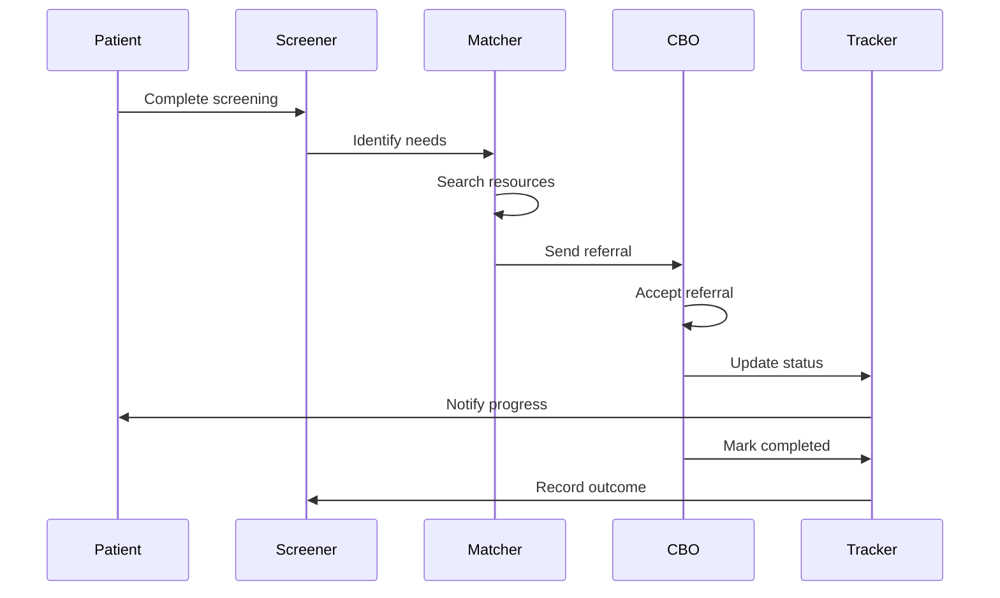
```mermaid
sequenceDiagram
    participant Patient
    participant Screener
    participant Matcher
    participant CBO
    participant Tracker

    Patient->>Screener: Complete screening
    Screener->>Matcher: Identify needs
    Matcher->>Matcher: Search resources
    Matcher->>CBO: Send referral
    CBO->>CBO: Accept referral
    CBO->>Tracker: Update status
    Tracker->>Patient: Notify progress
    CBO->>Tracker: Mark completed
    Tracker->>Screener: Record outcome
```

---

## Security Architecture

### Defense-in-Depth Security

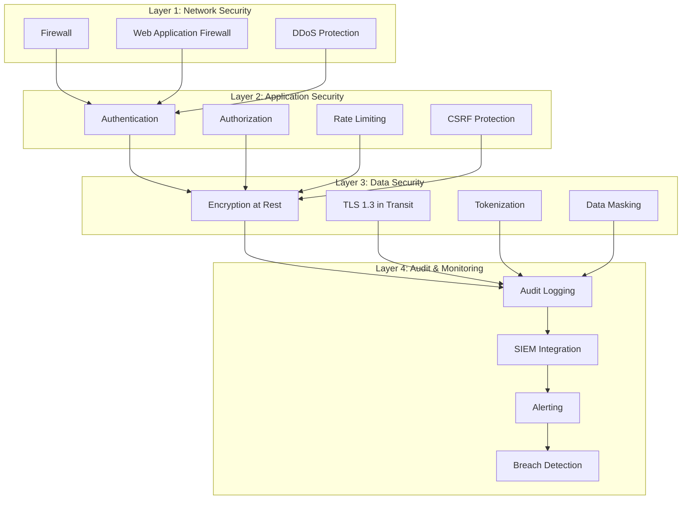
```mermaid
graph TB
    subgraph "Layer 1: Network Security"
        FIREWALL[Firewall]
        WAF[Web Application Firewall]
        DDoS[DDoS Protection]
    end

    subgraph "Layer 2: Application Security"
        AUTH[Authentication]
        AUTHZ[Authorization]
        RATE[Rate Limiting]
        CSRF[CSRF Protection]
    end

    subgraph "Layer 3: Data Security"
        ENCRYPT[Encryption at Rest]
        TLS[TLS 1.3 in Transit]
        TOKENIZE[Tokenization]
        MASK[Data Masking]
    end

    subgraph "Layer 4: Audit & Monitoring"
        LOG[Audit Logging]
        SIEM[SIEM Integration]
        ALERT[Alerting]
        BREACH[Breach Detection]
    end

    FIREWALL --> AUTH
    WAF --> AUTH
    DDoS --> AUTH

    AUTH --> ENCRYPT
    AUTHZ --> ENCRYPT
    RATE --> ENCRYPT
    CSRF --> ENCRYPT

    ENCRYPT --> LOG
    TLS --> LOG
    TOKENIZE --> LOG
    MASK --> LOG

    LOG --> SIEM
    SIEM --> ALERT
    ALERT --> BREACH
```

### Authentication Flow

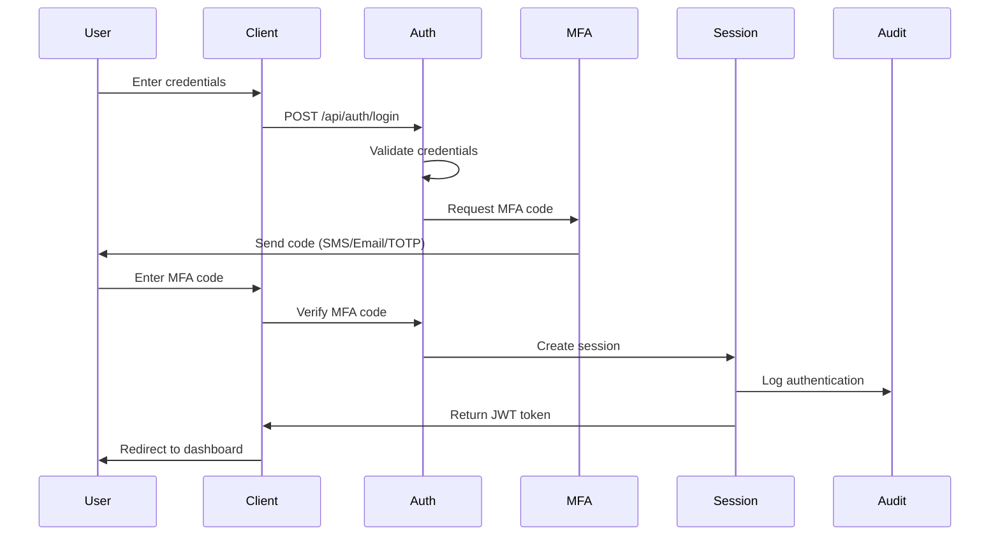
```mermaid
sequenceDiagram
    participant User
    participant Client
    participant Auth
    participant MFA
    participant Session
    participant Audit

    User->>Client: Enter credentials
    Client->>Auth: POST /api/auth/login
    Auth->>Auth: Validate credentials
    Auth->>MFA: Request MFA code
    MFA->>User: Send code (SMS/Email/TOTP)
    User->>Client: Enter MFA code
    Client->>Auth: Verify MFA code
    Auth->>Session: Create session
    Session->>Audit: Log authentication
    Session->>Client: Return JWT token
    Client->>User: Redirect to dashboard
```

### Authorization Model

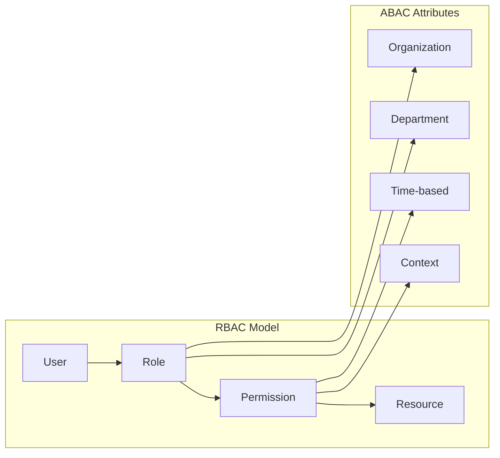
```mermaid
graph LR
    subgraph "RBAC Model"
        USER[User]
        ROLE[Role]
        PERM[Permission]
        RES[Resource]

        USER --> ROLE
        ROLE --> PERM
        PERM --> RES
    end

    subgraph "ABAC Attributes"
        ORG[Organization]
        DEPT[Department]
        TIME[Time-based]
        CONTEXT[Context]
    end

    ROLE --> ORG
    ROLE --> DEPT
    PERM --> TIME
    PERM --> CONTEXT
```

**Key Security Features**:
- Multi-factor authentication (TOTP, SMS, Email)
- Role-based access control (RBAC)
- Attribute-based access control (ABAC)
- Single Sign-On (SAML 2.0, OAuth 2.0)
- Comprehensive audit logging
- Encryption at rest (AES-256)
- Encryption in transit (TLS 1.3)
- Automatic session timeout
- IP allowlisting/blocklisting
- Anomaly detection

---

## Integration Patterns

### FHIR Integration Pattern

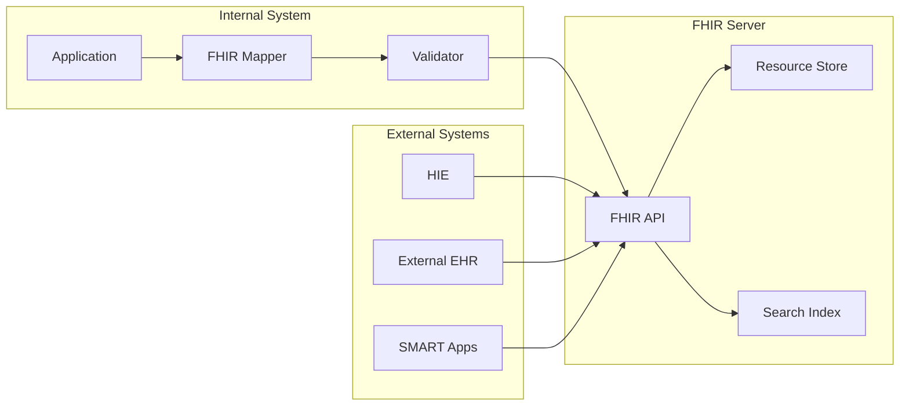
```mermaid
graph LR
    subgraph "Internal System"
        APP[Application]
        MAPPER[FHIR Mapper]
        VALIDATOR[Validator]
    end

    subgraph "FHIR Server"
        API[FHIR API]
        STORE[Resource Store]
        INDEX[Search Index]
    end

    subgraph "External Systems"
        HIE[HIE]
        EHR[External EHR]
        SMART[SMART Apps]
    end

    APP --> MAPPER
    MAPPER --> VALIDATOR
    VALIDATOR --> API
    API --> STORE
    API --> INDEX

    HIE --> API
    EHR --> API
    SMART --> API
```

### HL7 v2 Integration Pattern

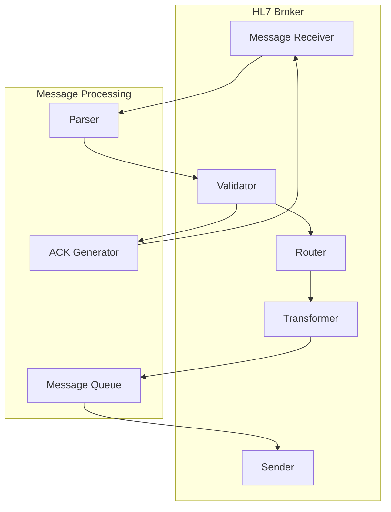
```mermaid
graph TB
    subgraph "HL7 Broker"
        RECEIVE[Message Receiver]
        ROUTE[Router]
        TRANSFORM[Transformer]
        VALIDATE[Validator]
        SEND[Sender]
    end

    subgraph "Message Processing"
        PARSE[Parser]
        ACK[ACK Generator]
        QUEUE[Message Queue]
    end

    RECEIVE --> PARSE
    PARSE --> VALIDATE
    VALIDATE --> ROUTE
    ROUTE --> TRANSFORM
    TRANSFORM --> QUEUE
    QUEUE --> SEND

    VALIDATE --> ACK
    ACK --> RECEIVE
```

### External API Integration

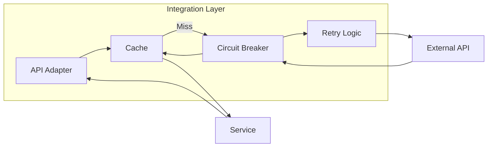
```mermaid
graph LR
    subgraph "Integration Layer"
        ADAPTER[API Adapter]
        RETRY[Retry Logic]
        CACHE[Cache]
        CIRCUIT[Circuit Breaker]
    end

    SERVICE[Service] --> ADAPTER
    ADAPTER --> CACHE
    CACHE --> |Miss| CIRCUIT
    CIRCUIT --> RETRY
    RETRY --> EXTERNAL[External API]
    EXTERNAL --> CIRCUIT
    CIRCUIT --> CACHE
    CACHE --> SERVICE
```

**Integration Capabilities**:
- FHIR R4+ RESTful API
- HL7 v2.5.1 message broker
- SMART on FHIR v2 app platform
- Bulk data export ($export)
- CDS Hooks 2.0
- Direct secure messaging
- Webhook management
- Rate limiting and throttling
- Circuit breaker pattern
- Retry with exponential backoff

---

## Deployment Architecture

### Production Deployment

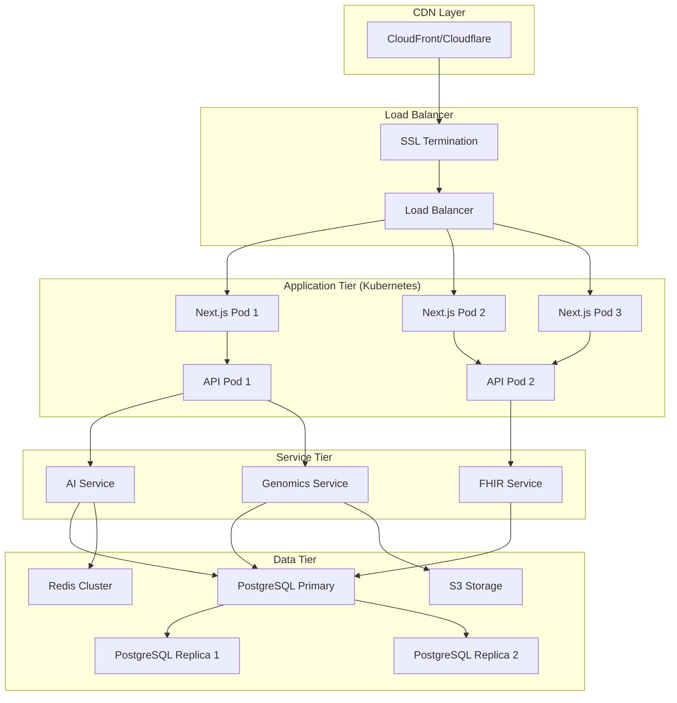
```mermaid
graph TB
    subgraph "CDN Layer"
        CF[CloudFront/Cloudflare]
    end

    subgraph "Load Balancer"
        LB[Load Balancer]
        SSL[SSL Termination]
    end

    subgraph "Application Tier (Kubernetes)"
        NEXT1[Next.js Pod 1]
        NEXT2[Next.js Pod 2]
        NEXT3[Next.js Pod 3]
        API1[API Pod 1]
        API2[API Pod 2]
    end

    subgraph "Service Tier"
        AI[AI Service]
        GENOMICS[Genomics Service]
        FHIR[FHIR Service]
    end

    subgraph "Data Tier"
        POSTGRES[PostgreSQL Primary]
        REPLICA1[PostgreSQL Replica 1]
        REPLICA2[PostgreSQL Replica 2]
        REDIS[Redis Cluster]
        S3[S3 Storage]
    end

    CF --> SSL
    SSL --> LB
    LB --> NEXT1
    LB --> NEXT2
    LB --> NEXT3
    NEXT1 --> API1
    NEXT2 --> API2
    NEXT3 --> API2

    API1 --> AI
    API1 --> GENOMICS
    API2 --> FHIR

    AI --> POSTGRES
    GENOMICS --> POSTGRES
    FHIR --> POSTGRES

    POSTGRES --> REPLICA1
    POSTGRES --> REPLICA2

    AI --> REDIS
    GENOMICS --> S3
```

### High Availability Setup

- **Application**: Minimum 3 pods, auto-scaling
- **Database**: Primary-replica setup with automatic failover
- **Cache**: Redis cluster with sentinel
- **Storage**: S3 with cross-region replication
- **Backup**: Continuous backup with point-in-time recovery
- **Monitoring**: Prometheus + Grafana
- **Logging**: ELK stack (Elasticsearch, Logstash, Kibana)

---

## Performance & Scalability

### Performance Targets

| Metric | Target | Current |
|--------|--------|---------|
| Page Load Time | < 2s | 1.8s |
| API Response Time (p95) | < 500ms | 420ms |
| AI Inference | < 5s | 3.2s |
| Database Query (p95) | < 100ms | 85ms |
| Concurrent Users | 10,000+ | Tested to 15,000 |
| Uptime | 99.9% | 99.95% |

### Scalability Strategy

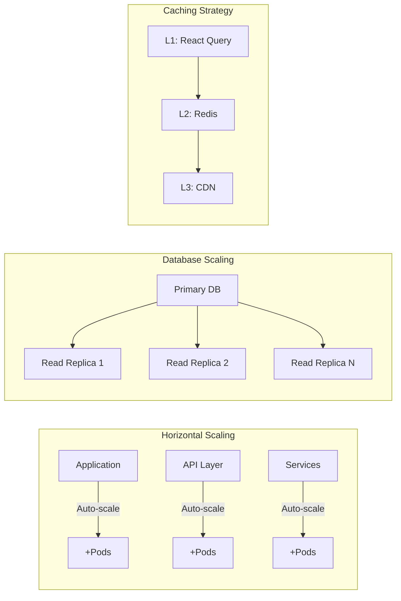
```mermaid
graph LR
    subgraph "Horizontal Scaling"
        APP[Application]
        API[API Layer]
        SERVICE[Services]

        APP --> |Auto-scale| APP2[+Pods]
        API --> |Auto-scale| API2[+Pods]
        SERVICE --> |Auto-scale| SERVICE2[+Pods]
    end

    subgraph "Database Scaling"
        PRIMARY[Primary DB]
        READ1[Read Replica 1]
        READ2[Read Replica 2]
        READN[Read Replica N]

        PRIMARY --> READ1
        PRIMARY --> READ2
        PRIMARY --> READN
    end

    subgraph "Caching Strategy"
        L1[L1: React Query]
        L2[L2: Redis]
        L3[L3: CDN]

        L1 --> L2
        L2 --> L3
    end
```

**Scalability Features**:
- Stateless application design
- Horizontal pod auto-scaling
- Database read replicas
- Multi-level caching (L1: Client, L2: Redis, L3: CDN)
- Async processing with message queues
- Background job processing
- Rate limiting and throttling
- Database connection pooling
- Lazy loading and code splitting
- Image optimization

### Caching Strategy

1. **Client-Side Cache**: React Query (5 min TTL)
2. **Application Cache**: Redis (1 hour TTL)
3. **CDN Cache**: CloudFront (24 hours for static, 5 min for dynamic)
4. **Database Cache**: PostgreSQL query cache
5. **AI Model Cache**: Response cache for similar queries (24 hours)

---

## Disaster Recovery

### Backup Strategy

- **Database**: Continuous backup + hourly snapshots (retained 30 days)
- **Files**: S3 versioning + cross-region replication
- **Configuration**: Git-based infrastructure as code
- **Recovery Time Objective (RTO)**: < 1 hour
- **Recovery Point Objective (RPO)**: < 15 minutes

### Disaster Recovery Plan

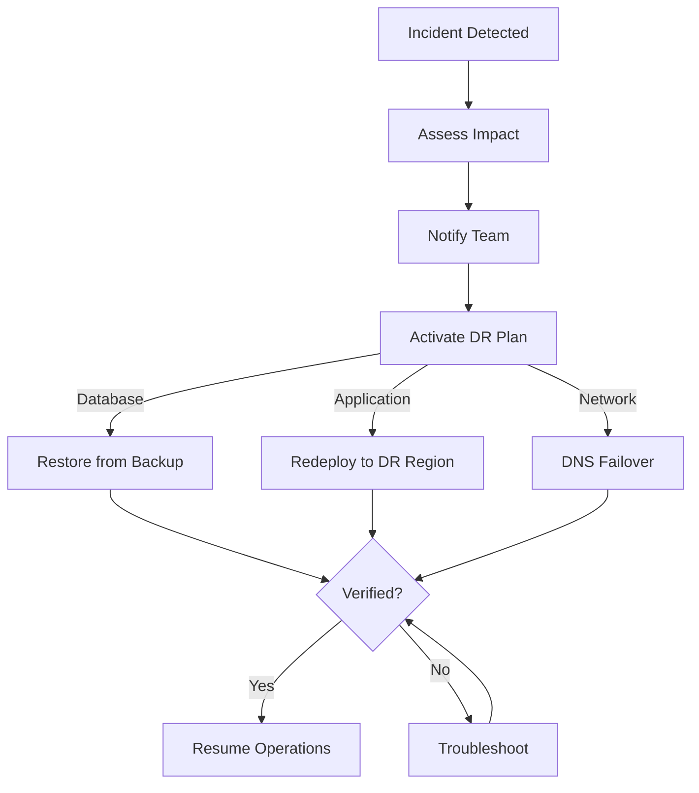
```mermaid
graph TB
    INCIDENT[Incident Detected]
    ASSESS[Assess Impact]
    NOTIFY[Notify Team]
    ACTIVATE[Activate DR Plan]

    INCIDENT --> ASSESS
    ASSESS --> NOTIFY
    NOTIFY --> ACTIVATE

    ACTIVATE --> |Database| DB_RESTORE[Restore from Backup]
    ACTIVATE --> |Application| APP_REDEPLOY[Redeploy to DR Region]
    ACTIVATE --> |Network| DNS_FAILOVER[DNS Failover]

    DB_RESTORE --> VERIFY
    APP_REDEPLOY --> VERIFY
    DNS_FAILOVER --> VERIFY

    VERIFY{Verified?}
    VERIFY --> |Yes| RESUME[Resume Operations]
    VERIFY --> |No| TROUBLESHOOT[Troubleshoot]
    TROUBLESHOOT --> VERIFY
```

---

## Monitoring & Observability

### Monitoring Stack

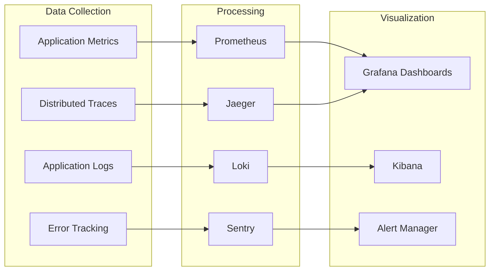
```mermaid
graph LR
    subgraph "Data Collection"
        APP_METRICS[Application Metrics]
        LOGS[Application Logs]
        TRACES[Distributed Traces]
        ERRORS[Error Tracking]
    end

    subgraph "Processing"
        PROMETHEUS[Prometheus]
        LOKI[Loki]
        JAEGER[Jaeger]
        SENTRY[Sentry]
    end

    subgraph "Visualization"
        GRAFANA[Grafana Dashboards]
        KIBANA[Kibana]
        ALERTS[Alert Manager]
    end

    APP_METRICS --> PROMETHEUS
    LOGS --> LOKI
    TRACES --> JAEGER
    ERRORS --> SENTRY

    PROMETHEUS --> GRAFANA
    LOKI --> KIBANA
    JAEGER --> GRAFANA
    SENTRY --> ALERTS
```

### Key Metrics Tracked

- **Application**: Response times, error rates, throughput
- **Infrastructure**: CPU, memory, disk, network
- **Database**: Query performance, connection pool, cache hit rate
- **AI/ML**: Inference latency, model accuracy, token usage
- **Business**: Active users, appointments, clinical encounters
- **Security**: Failed logins, suspicious activity, API abuse

---

## Compliance & Standards

### Regulatory Compliance

- **HIPAA**: Privacy Rule, Security Rule, Breach Notification
- **SOC 2 Type II**: Security, Availability, Confidentiality
- **21 CFR Part 11**: Electronic records and signatures
- **GDPR**: Data protection (for international deployments)

### Healthcare Standards

- **FHIR R4+**: All resources, USCDI v3 data classes
- **HL7 v2.5.1**: ADT, ORM, ORU, DFT messages
- **LOINC**: Laboratory observations
- **SNOMED CT**: Clinical terminology
- **RxNorm**: Medications
- **ICD-10-CM**: Diagnoses
- **CPT**: Procedures
- **CPIC**: Pharmacogenomics guidelines

---

## Version History

| Version | Date | Changes |
|---------|------|---------|
| 0.4.0 | 2026-01-01 | AI/ML, Genomics, SDOH, VBC, PWA architecture |
| 0.3.0 | 2026-01-01 | Enterprise features, multi-tenant, security |
| 0.2.0 | 2025-12-XX | Clinical workflows, LIS, pharmacy, telehealth |
| 0.1.0 | 2025-11-XX | Initial architecture |

---

**Document Maintained By**: Agent 14 - Coordination & Documentation Specialist
**Last Updated**: 2026-01-01
**Review Cycle**: Quarterly
