# Lithic Enterprise Healthcare Platform v0.4 - User Flow Diagrams

> Comprehensive Mermaid diagrams documenting all user experiences across the platform

## Table of Contents
1. [System Architecture Overview](#system-architecture-overview)
2. [Authentication & Authorization Flows](#authentication--authorization-flows)
3. [Patient Experience Flows](#patient-experience-flows)
4. [Clinician Workflow Flows](#clinician-workflow-flows)
5. [Revenue Cycle Flows](#revenue-cycle-flows)
6. [Administrative Flows](#administrative-flows)
7. [AI/ML Integration Flows](#aiml-integration-flows)
8. [Genomics Platform Flows](#genomics-platform-flows)
9. [SDOH Module Flows](#sdoh-module-flows)
10. [Value-Based Care Flows](#value-based-care-flows)
11. [Real-time Collaboration Flows](#real-time-collaboration-flows)

---

## System Architecture Overview


---

## Authentication & Authorization Flows

### Multi-Factor Authentication Flow


### SSO Enterprise Authentication Flow


### Role-Based Access Control Flow


---

## Patient Experience Flows

### Patient Portal Journey


### Patient Self-Scheduling Flow


### Patient Engagement & Gamification Flow


### Telehealth Visit Flow


---

## Clinician Workflow Flows

### Clinical Documentation with AI Flow


### Clinical Decision Support Flow


### Order Entry & CPOE Flow


### Sepsis Early Warning Flow

```mermaid
flowchart TB
    subgraph "Sepsis Detection System"
        subgraph "Data Collection"
            VITALS[Vital Signs Monitor] --> STREAM[Data Stream]
            LABS[Lab Results] --> STREAM
            NOTES[Clinical Notes] --> STREAM
            MEDS[Medication Admin] --> STREAM
        end

        subgraph "SIRS Criteria Check"
            STREAM --> TEMP{Temp > 38°C or < 36°C}
            STREAM --> HR{HR > 90}
            STREAM --> RR{RR > 20 or PaCO2 < 32}
            STREAM --> WBC{WBC > 12K or < 4K}
        end

        subgraph "qSOFA Score"
            STREAM --> SBP{SBP ≤ 100}
            STREAM --> GCS{GCS < 15}
            STREAM --> RR2{RR ≥ 22}
        end

        subgraph "ML Prediction"
            TEMP --> ML_MODEL[Sepsis ML Model]
            HR --> ML_MODEL
            RR --> ML_MODEL
            WBC --> ML_MODEL
            SBP --> ML_MODEL
            GCS --> ML_MODEL
            RR2 --> ML_MODEL
            LABS --> ML_MODEL

            ML_MODEL --> PROB[Probability Score]
        end

        subgraph "Alert Escalation"
            PROB --> |>80%| CRITICAL_ALERT[🔴 CRITICAL ALERT]
            PROB --> |50-80%| HIGH_ALERT[🟠 HIGH ALERT]
            PROB --> |30-50%| MODERATE_ALERT[🟡 MODERATE ALERT]
            PROB --> |<30%| MONITOR[Continue Monitoring]

            CRITICAL_ALERT --> RAPID[Rapid Response Team]
            CRITICAL_ALERT --> PAGE[Page Physician]
            CRITICAL_ALERT --> PROTOCOL[Start Sepsis Protocol]

            HIGH_ALERT --> NOTIFY[Notify Care Team]
            HIGH_ALERT --> ORDER[Suggest Orders]

            MODERATE_ALERT --> WATCH[Enhanced Monitoring]
        end
    end
```



---

## Revenue Cycle Flows

### End-to-End Revenue Cycle Flow


### AI-Powered Coding Flow


### Value-Based Care Payment Flow


---

## Administrative Flows

### Multi-Tenant Organization Management


### Audit Trail & Compliance Flow


### Enterprise Workflow Designer Flow

```mermaid
flowchart TB
    subgraph "Workflow Designer v0.4"
        subgraph "Design Canvas"
            START[Start Node] --> COND1{Condition}
            COND1 --> |Yes| TASK1[Task: Review]
            COND1 --> |No| TASK2[Task: Auto-approve]

            TASK1 --> APPROVE{Approved?}
            APPROVE --> |Yes| TASK3[Task: Process]
            APPROVE --> |No| ESCALATE[Escalation]

            TASK2 --> TASK3
            ESCALATE --> TASK1

            TASK3 --> PARALLEL[Parallel Gateway]
            PARALLEL --> NOTIFY[Notify User]
            PARALLEL --> UPDATE[Update System]
            PARALLEL --> LOG[Audit Log]

            NOTIFY --> JOIN[Join Gateway]
            UPDATE --> JOIN
            LOG --> JOIN

            JOIN --> END[End Node]
        end

        subgraph "Node Types"
            NT_START[▶ Start]
            NT_END[⏹ End]
            NT_TASK[📋 Task]
            NT_COND[◇ Condition]
            NT_PARALLEL[⋈ Parallel]
            NT_TIMER[⏱ Timer]
            NT_EMAIL[✉ Email]
            NT_API[🔗 API Call]
            NT_HUMAN[👤 Human Task]
        end

        subgraph "Properties Panel"
            PROPS[Selected Node]
            PROPS --> NAME[Name]
            PROPS --> DESC[Description]
            PROPS --> ASSIGN[Assignment]
            PROPS --> SLA[SLA Settings]
            PROPS --> ACTIONS[Actions]
        end
    end
```



---

## AI/ML Integration Flows

### GPT-4 Clinical Assistant Flow


### Predictive Analytics Pipeline


---

## Genomics Platform Flows

### Genomic Data Processing Flow

```mermaid
flowchart TB
    subgraph "Genomics Platform v0.4"
        subgraph "Data Input"
            VCF[VCF Files] --> PARSE[VCF Parser]
            FASTQ[FASTQ Files] --> ALIGN[Alignment Pipeline]
            HL7G[HL7 Genomics] --> TRANSFORM[Data Transform]
        end

        subgraph "Variant Processing"
            PARSE --> ANNOTATE[Variant Annotation]
            ALIGN --> CALL[Variant Calling]
            CALL --> ANNOTATE
            TRANSFORM --> ANNOTATE

            ANNOTATE --> CLINVAR[ClinVar Lookup]
            ANNOTATE --> GNOMAD[gnomAD Frequency]
            ANNOTATE --> COSMIC[COSMIC Cancer DB]
        end

        subgraph "Clinical Interpretation"
            CLINVAR --> CLASSIFY[Variant Classification]
            GNOMAD --> CLASSIFY
            COSMIC --> CLASSIFY

            CLASSIFY --> PATHOGENIC[Pathogenic]
            CLASSIFY --> LIKELY_PATH[Likely Pathogenic]
            CLASSIFY --> VUS[VUS]
            CLASSIFY --> LIKELY_BEN[Likely Benign]
            CLASSIFY --> BENIGN[Benign]
        end

        subgraph "Pharmacogenomics"
            PATHOGENIC --> PGX[PGx Analysis]
            PGX --> CPIC[CPIC Guidelines]
            CPIC --> DRUG_REC[Drug Recommendations]
            DRUG_REC --> CDS[CDS Integration]
        end

        subgraph "Risk Assessment"
            PATHOGENIC --> RISK[Risk Calculator]
            RISK --> CANCER[Cancer Risk]
            RISK --> CARDIAC[Cardiac Risk]
            RISK --> HEREDITARY[Hereditary Conditions]
        end

        subgraph "Reporting"
            DRUG_REC --> REPORT[Clinical Report]
            CANCER --> REPORT
            CARDIAC --> REPORT
            HEREDITARY --> REPORT

            REPORT --> PDF[PDF Generation]
            REPORT --> EHR_INT[EHR Integration]
            REPORT --> COUNSEL[Genetic Counseling]
        end
    end
```

### Pharmacogenomics CDS Flow

```mermaid
sequenceDiagram
    participant DOC as Physician
    participant CPOE as Order Entry
    participant CDS as CDS Engine
    participant PGX as PGx Service
    participant GENOMICS as Genomics DB
    participant CPIC as CPIC Guidelines
    participant ALERT as Alert System

    DOC->>CPOE: Order medication
    CPOE->>CDS: Check for PGx
    CDS->>PGX: Query patient genetics

    PGX->>GENOMICS: Get patient variants
    GENOMICS-->>PGX: Relevant variants

    PGX->>CPIC: Get drug-gene interactions
    CPIC-->>PGX: CPIC recommendations

    PGX->>PGX: Calculate metabolizer status

    alt Poor Metabolizer
        PGX-->>CDS: High risk - dose adjustment needed
        CDS->>ALERT: Generate critical alert
        ALERT-->>DOC: ⚠️ PGx Alert: Poor metabolizer
        Note over DOC: Suggest dose reduction or alternative
    else Ultrarapid Metabolizer
        PGX-->>CDS: Increased metabolism
        CDS->>ALERT: Generate warning
        ALERT-->>DOC: ⚠️ PGx Alert: Ultrarapid metabolizer
        Note over DOC: Suggest dose increase or alternative
    else Normal Metabolizer
        PGX-->>CDS: No PGx concern
        CDS-->>CPOE: Proceed with order
    end

    DOC->>CPOE: Acknowledge & proceed
    CPOE->>CPOE: Complete order
```

---

## SDOH Module Flows

### Social Needs Screening Flow

```mermaid
flowchart TB
    subgraph "SDOH Screening & Intervention"
        subgraph "Screening Triggers"
            VISIT[Patient Visit] --> TRIGGER{Screening Due?}
            ADMIT[Admission] --> TRIGGER
            ANNUAL[Annual Wellness] --> TRIGGER
            RISK[High Risk Flag] --> TRIGGER
        end

        subgraph "Screening Tools"
            TRIGGER --> |Yes| SELECT[Select Tool]
            SELECT --> PRAPARE[PRAPARE]
            SELECT --> AHC[AHC HRSN]
            SELECT --> CUSTOM[Custom Screen]
        end

        subgraph "Data Collection"
            PRAPARE --> COLLECT[Collect Responses]
            AHC --> COLLECT
            CUSTOM --> COLLECT

            COLLECT --> FOOD[Food Insecurity]
            COLLECT --> HOUSING[Housing Instability]
            COLLECT --> TRANSPORT[Transportation]
            COLLECT --> UTILITY[Utility Needs]
            COLLECT --> SAFETY[Personal Safety]
            COLLECT --> EMPLOY[Employment]
        end

        subgraph "Need Identification"
            FOOD --> ANALYZE{Analyze Needs}
            HOUSING --> ANALYZE
            TRANSPORT --> ANALYZE
            UTILITY --> ANALYZE
            SAFETY --> ANALYZE
            EMPLOY --> ANALYZE

            ANALYZE --> URGENT[Urgent Needs]
            ANALYZE --> MODERATE[Moderate Needs]
            ANALYZE --> LOW[Low Priority]
        end

        subgraph "Resource Matching"
            URGENT --> MATCH[Resource Matcher]
            MODERATE --> MATCH

            MATCH --> COMMUNITY[Community Resources]
            MATCH --> GOVT[Government Programs]
            MATCH --> NONPROFIT[Nonprofit Services]

            COMMUNITY --> REFER[Generate Referral]
            GOVT --> REFER
            NONPROFIT --> REFER
        end

        subgraph "Care Coordination"
            REFER --> COORD[Care Coordinator]
            COORD --> FOLLOWUP[Follow-up Tasks]
            FOLLOWUP --> OUTCOME[Track Outcomes]
            OUTCOME --> REPORT[Outcomes Report]
        end
    end
```

### Community Resource Integration Flow

```mermaid
sequenceDiagram
    participant SW as Social Worker
    participant SDOH as SDOH Module
    participant FIND as Resource Finder
    participant API as Community APIs
    participant COORD as Care Coordination
    participant PATIENT as Patient Portal
    participant TRACK as Outcome Tracker

    SW->>SDOH: Identify patient need
    SDOH->>FIND: Search resources

    FIND->>API: Query 211 database
    API-->>FIND: Local resources

    FIND->>API: Query food banks
    API-->>FIND: Food resources

    FIND->>API: Query housing
    API-->>FIND: Housing resources

    FIND-->>SDOH: Matched resources
    SDOH-->>SW: Display options

    SW->>SDOH: Select resources
    SDOH->>COORD: Create referrals

    par Notify parties
        COORD->>PATIENT: Send resource list
        COORD->>API: Send referral to CBO
    end

    PATIENT-->>TRACK: Patient accessed resource
    API-->>TRACK: CBO confirms service

    TRACK->>TRACK: Update care plan
    TRACK-->>SDOH: Outcome recorded
```

---

## Value-Based Care Flows

### ACO Performance Management Flow

```mermaid
flowchart TB
    subgraph "ACO Management Suite"
        subgraph "Patient Attribution"
            CLAIMS[Claims Data] --> ATTR[Attribution Engine]
            ATTR --> ASSIGNED[Assigned Patients]
            ATTR --> PROSPECTIVE[Prospective Attribution]
        end

        subgraph "Quality Measures"
            ASSIGNED --> QUALITY[Quality Engine]
            QUALITY --> PREV[Preventive Care]
            QUALITY --> CHRONIC[Chronic Care]
            QUALITY --> OUTCOME[Outcomes]
            QUALITY --> SAFETY[Patient Safety]
            QUALITY --> EXPER[Patient Experience]
        end

        subgraph "Cost Tracking"
            ASSIGNED --> COST[Cost Analyzer]
            COST --> TOTAL[Total Cost of Care]
            COST --> UTIL[Utilization]
            COST --> LEAKAGE[Network Leakage]
        end

        subgraph "Risk Adjustment"
            ASSIGNED --> RISK[Risk Adjuster]
            RISK --> HCC[HCC Coding]
            RISK --> RAF[RAF Score]
            RAF --> BENCHMARK[Adjusted Benchmark]
        end

        subgraph "Performance Dashboard"
            PREV --> DASH[ACO Dashboard]
            CHRONIC --> DASH
            OUTCOME --> DASH
            TOTAL --> DASH
            BENCHMARK --> DASH

            DASH --> SHARED[Shared Savings Calc]
            SHARED --> DISTRIBUTE[Distribution Model]
        end

        subgraph "Care Gap Management"
            QUALITY --> GAPS[Care Gaps]
            GAPS --> OUTREACH[Patient Outreach]
            OUTREACH --> CLOSE[Gap Closure]
            CLOSE --> QUALITY
        end
    end
```

### MIPS Reporting Dashboard Flow

```mermaid
flowchart TB
    subgraph "MIPS Dashboard v0.4"
        subgraph "Data Sources"
            EHR[EHR Data] --> COLLECT[Data Collector]
            CLAIMS[Claims] --> COLLECT
            REGISTRY[Registry] --> COLLECT
            SURVEY[CAHPS Survey] --> COLLECT
        end

        subgraph "Category Scoring"
            COLLECT --> QUALITY_CAT[Quality - 30%]
            COLLECT --> PI_CAT[Promoting Interoperability - 25%]
            COLLECT --> IA_CAT[Improvement Activities - 15%]
            COLLECT --> COST_CAT[Cost - 30%]
        end

        subgraph "Quality Measures"
            QUALITY_CAT --> Q1[Measure 1: Diabetes]
            QUALITY_CAT --> Q2[Measure 2: Preventive]
            QUALITY_CAT --> Q3[Measure 3: Hypertension]
            QUALITY_CAT --> Q4[Measure 4: Immunization]
            QUALITY_CAT --> Q5[Measure 5: Screening]
            QUALITY_CAT --> Q6[Measure 6: Outcomes]
        end

        subgraph "PI Measures"
            PI_CAT --> E_RX[e-Prescribing]
            PI_CAT --> HIE_M[Health Information Exchange]
            PI_CAT --> PATIENT_ACCESS[Patient Access]
            PI_CAT --> SECURITY[Security Risk Analysis]
        end

        subgraph "Final Score"
            Q1 --> FINAL[Final Score Calculator]
            Q2 --> FINAL
            Q3 --> FINAL
            Q4 --> FINAL
            Q5 --> FINAL
            Q6 --> FINAL
            E_RX --> FINAL
            HIE_M --> FINAL
            PATIENT_ACCESS --> FINAL
            COST_CAT --> FINAL
            IA_CAT --> FINAL

            FINAL --> PAYMENT[Payment Adjustment]
            PAYMENT --> |≥75| BONUS[Positive Adjustment]
            PAYMENT --> |<75| NEUTRAL[Neutral]
            PAYMENT --> |<45| PENALTY[Negative Adjustment]
        end
    end
```

---

## Real-time Collaboration Flows

### Video Consultation Flow

```mermaid
sequenceDiagram
    participant PROV as Provider
    participant COLLAB as Collaboration Hub
    participant VIDEO as Video Service
    participant RECORD as Recording Service
    participant SPEC as Specialist
    participant EHR as EHR System
    participant PATIENT as Patient (optional)

    PROV->>COLLAB: Request consultation
    COLLAB->>VIDEO: Create room
    VIDEO-->>COLLAB: Room URL

    COLLAB->>SPEC: Send invitation
    SPEC->>VIDEO: Join room

    opt Patient Included
        COLLAB->>PATIENT: Send patient link
        PATIENT->>VIDEO: Join room
    end

    PROV->>VIDEO: Join room
    VIDEO->>VIDEO: Start session

    opt Recording Consent
        VIDEO->>RECORD: Start recording
    end

    rect rgb(200, 220, 255)
        Note over PROV,SPEC: Consultation Session
        PROV->>VIDEO: Share screen (images)
        PROV->>EHR: Pull up patient chart
        EHR-->>PROV: Clinical data
        SPEC->>VIDEO: Provide recommendations
        SPEC->>COLLAB: Add notes
    end

    SPEC->>COLLAB: End session
    COLLAB->>VIDEO: Close room

    opt Recording
        RECORD->>RECORD: Process recording
        RECORD->>EHR: Attach to encounter
    end

    COLLAB->>EHR: Document consultation
    COLLAB->>PROV: Summary notification
```

### Clinical Whiteboard Collaboration

```mermaid
flowchart TB
    subgraph "Clinical Whiteboard v0.4"
        subgraph "Participants"
            LEAD[Lead Physician]
            NURSE[Nurse]
            SPEC[Specialist]
            CARE[Care Coordinator]
        end

        subgraph "Whiteboard Canvas"
            LEAD --> CANVAS[Shared Canvas]
            NURSE --> CANVAS
            SPEC --> CANVAS
            CARE --> CANVAS

            CANVAS --> DRAW[Drawing Tools]
            CANVAS --> TEXT[Text Annotations]
            CANVAS --> IMAGES[Image Upload]
            CANVAS --> STICKY[Sticky Notes]
            CANVAS --> ARROWS[Connectors]
        end

        subgraph "Clinical Templates"
            CANVAS --> TEMP[Template Library]
            TEMP --> BODY[Body Diagram]
            TEMP --> TIMELINE[Patient Timeline]
            TEMP --> FLOWCHART[Care Flowchart]
            TEMP --> MEDS[Medication List]
            TEMP --> CHECKLIST[Checklist]
        end

        subgraph "Real-time Features"
            CANVAS --> SYNC[Real-time Sync]
            SYNC --> CURSORS[Multiple Cursors]
            SYNC --> PRESENCE[User Presence]
            SYNC --> VOICE[Voice Chat]
            SYNC --> HISTORY[Version History]
        end

        subgraph "Integration"
            CANVAS --> SAVE[Save to EHR]
            SAVE --> ATTACH[Attach to Encounter]
            SAVE --> EXPORT[Export as PDF]
            SAVE --> SHARE[Share Link]
        end
    end
```

---

## Mobile & PWA Flows

### Progressive Web App Architecture

```mermaid
flowchart TB
    subgraph "PWA Architecture v0.4"
        subgraph "App Shell"
            BROWSER[Browser] --> SW[Service Worker]
            SW --> CACHE[Cache Storage]
            SW --> IDB[IndexedDB]
        end

        subgraph "Offline Support"
            CACHE --> STATIC[Static Assets]
            CACHE --> API_CACHE[API Responses]
            IDB --> PATIENT_DATA[Patient Data]
            IDB --> QUEUE[Offline Queue]
        end

        subgraph "Background Sync"
            QUEUE --> SYNC[Background Sync]
            SYNC --> |Online| API[API Server]
            API --> |Conflict| RESOLVE[Conflict Resolution]
            RESOLVE --> IDB
        end

        subgraph "Push Notifications"
            PUSH_SRV[Push Server] --> SW
            SW --> NOTIFY[Show Notification]
            NOTIFY --> BADGE[Update Badge]
            NOTIFY --> CLICK[Handle Click]
            CLICK --> NAVIGATE[Navigate to Content]
        end

        subgraph "Device Features"
            SW --> CAMERA[Camera Access]
            SW --> GEO[Geolocation]
            SW --> BIOMETRIC[Biometric Auth]
            SW --> SHARE[Web Share API]
        end

        subgraph "Install Experience"
            BROWSER --> MANIFEST[Web Manifest]
            MANIFEST --> INSTALL[Install Prompt]
            INSTALL --> HOME[Add to Home Screen]
            HOME --> STANDALONE[Standalone App]
        end
    end
```

### Offline-First Data Sync Flow

```mermaid
sequenceDiagram
    participant USER as User
    participant APP as PWA
    participant SW as Service Worker
    participant IDB as IndexedDB
    participant QUEUE as Sync Queue
    participant API as Backend API
    participant CONFLICT as Conflict Resolver

    USER->>APP: Perform action (offline)
    APP->>IDB: Save locally
    APP->>QUEUE: Add to sync queue
    APP-->>USER: Optimistic UI update

    Note over SW: Device goes online

    SW->>QUEUE: Process queue

    loop Each queued item
        QUEUE->>API: Sync request

        alt Success
            API-->>QUEUE: Synced
            QUEUE->>IDB: Mark synced
        else Conflict
            API-->>CONFLICT: Version conflict
            CONFLICT->>CONFLICT: Compare versions

            alt Server wins
                CONFLICT->>IDB: Update local
                CONFLICT->>APP: Notify user
            else Client wins
                CONFLICT->>API: Force update
            else Manual merge
                CONFLICT->>APP: Show merge UI
                USER->>APP: Resolve conflict
                APP->>API: Submit resolution
            end
        else Error
            QUEUE->>QUEUE: Retry with backoff
        end
    end

    QUEUE-->>APP: Sync complete
    APP-->>USER: Update UI
```

---

## System Integration Overview

```mermaid
graph TB
    subgraph "Lithic Platform v0.4"
        subgraph "Core EHR"
            PATIENT[Patient Management]
            CLINICAL[Clinical Workflows]
            ORDERS[Order Management]
            DOCS[Documentation]
        end

        subgraph "Revenue Cycle"
            BILLING[Billing Engine]
            CLAIMS[Claims Management]
            VBC[Value-Based Care]
            CODING[AI Coding]
        end

        subgraph "Analytics"
            BI[Business Intelligence]
            POP[Population Health]
            PREDICT[Predictive Models]
            QUALITY[Quality Measures]
        end

        subgraph "Advanced Modules"
            GENOMICS[Genomics]
            SDOH[SDOH]
            AI[AI/ML Platform]
            COLLAB[Collaboration]
        end
    end

    subgraph "External Systems"
        HIE[Health Information Exchange]
        PAYER[Payer Systems]
        LAB[Reference Labs]
        PHARMACY[Pharmacy Networks]
        REGISTRY[Clinical Registries]
        CBO[Community Organizations]
        DEVICE[Medical Devices]
    end

    CLINICAL <--> HIE
    BILLING <--> PAYER
    ORDERS <--> LAB
    ORDERS <--> PHARMACY
    QUALITY <--> REGISTRY
    SDOH <--> CBO
    CLINICAL <--> DEVICE
```

---

## Summary

This document contains comprehensive Mermaid diagrams covering all major user flows in the Lithic Enterprise Healthcare Platform v0.4:

1. **Architecture**: System overview and component relationships
2. **Authentication**: MFA, SSO, and RBAC flows
3. **Patient Experience**: Portal, scheduling, engagement, telehealth
4. **Clinical Workflows**: Documentation, CDS, CPOE, sepsis detection
5. **Revenue Cycle**: End-to-end billing, AI coding, value-based care
6. **Administration**: Multi-tenant, audit, workflow designer
7. **AI/ML**: GPT-4 assistant, predictive analytics pipeline
8. **Genomics**: VCF processing, pharmacogenomics, risk assessment
9. **SDOH**: Screening, resource matching, care coordination
10. **Value-Based Care**: ACO management, MIPS reporting
11. **Collaboration**: Video consultation, clinical whiteboard
12. **Mobile/PWA**: Offline-first architecture, background sync

Each flow is designed to demonstrate enterprise-grade capabilities that compete with Epic Systems while leveraging modern technologies like AI/ML, genomics, and advanced analytics.

---

*Generated for Lithic Enterprise Healthcare Platform v0.4*
*Copyright (c) 2026 Lithic Healthcare Systems*
