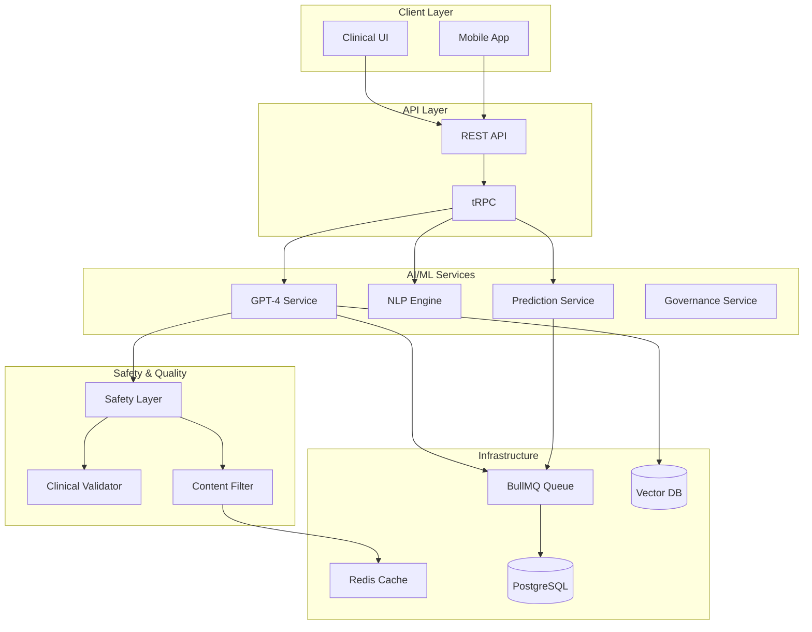

# AI/ML Platform - GPT-4 Integration Guide

**Module**: AI/ML Platform
**Version**: 0.4.0
**Date**: 2026-01-01
**Agent**: Agent 2 - AI/ML Engine & GPT-4

## Table of Contents

1. [Overview](#overview)
2. [Architecture](#architecture)
3. [GPT-4 Integration](#gpt-4-integration)
4. [Prediction Models](#prediction-models)
5. [NLP Capabilities](#nlp-capabilities)
6. [Model Governance](#model-governance)
7. [Safety Considerations](#safety-considerations)
8. [Configuration](#configuration)
9. [Usage Examples](#usage-examples)
10. [Performance & Monitoring](#performance--monitoring)

---

## Overview

The AI/ML Platform provides cutting-edge artificial intelligence and machine learning capabilities for clinical decision support, documentation assistance, and predictive analytics. Built on OpenAI's GPT-4 and custom TensorFlow.js models, the platform offers HIPAA-compliant, production-ready AI services.

### Key Features

- **GPT-4 Clinical Assistant**: Conversational AI for clinical documentation and medical questions
- **Medical Summarization**: Intelligent clinical note summarization and abstraction
- **NLP Processing**: Entity extraction, classification, and semantic analysis
- **Prediction Models**: ML models for readmission, sepsis, length-of-stay, and no-show prediction
- **Model Governance**: Comprehensive model registry, monitoring, and explainability
- **Safety Layer**: Content filtering, hallucination detection, and clinical validation

### Use Cases

1. **Clinical Documentation**: AI-assisted note writing and summarization
2. **Decision Support**: Evidence-based recommendations and differential diagnoses
3. **Risk Prediction**: Early warning systems for sepsis, readmission, and adverse events
4. **Patient Education**: Generating patient-friendly explanations
5. **Quality Improvement**: Identifying care gaps and optimization opportunities

---

## Architecture

### System Architecture



### Module Structure

```
/src/lib/ai/
├── gpt/
│   ├── client.ts              # OpenAI API client
│   ├── clinical-assistant.ts  # GPT-4 clinical assistant
│   ├── prompts.ts             # Prompt templates
│   └── safety-layer.ts        # Content filtering & validation
├── nlp/
│   ├── entity-extractor.ts    # Clinical entity extraction
│   ├── summarizer.ts          # Text summarization
│   └── text-classifier.ts     # Document classification
├── prediction/
│   ├── readmission-model.ts   # Readmission risk predictor
│   ├── sepsis-model.ts        # Sepsis early warning
│   ├── length-of-stay.ts      # LOS prediction
│   └── no-show-model.ts       # Appointment no-show predictor
└── governance/
    ├── model-registry.ts      # Model versioning & tracking
    ├── monitoring.ts          # Performance monitoring
    └── explainability.ts      # Model interpretability
```

---

## GPT-4 Integration

### Clinical Assistant

The GPT-4 Clinical Assistant provides conversational AI for clinical documentation and medical questions.

#### Features

- **Context-Aware Responses**: Understands patient context and medical history
- **Evidence-Based**: Cites medical guidelines and literature
- **Specialty-Specific**: Tailored responses for different medical specialties
- **Multi-Turn Conversations**: Maintains conversation context
- **Streaming Responses**: Real-time response generation

#### Configuration

```typescript
// /src/lib/ai/gpt/client.ts
import OpenAI from 'openai';

export const openai = new OpenAI({
  apiKey: process.env.OPENAI_API_KEY,
  organization: process.env.OPENAI_ORG_ID,
  maxRetries: 3,
  timeout: 60000,
});

export const GPT_CONFIG = {
  model: 'gpt-4-turbo',
  maxTokens: 4096,
  temperature: 0.3, // Lower temperature for medical accuracy
  topP: 1.0,
  frequencyPenalty: 0.0,
  presencePenalty: 0.0,
};
```

#### Usage Example

```typescript
import { ClinicalAssistant } from '@/lib/ai/gpt/clinical-assistant';

// Initialize assistant
const assistant = new ClinicalAssistant({
  userId: 'user_123',
  sessionId: 'session_456',
});

// Ask a clinical question
const response = await assistant.chat({
  message: 'What are the diagnostic criteria for sepsis?',
  context: {
    patientId: 'patient_789',
    specialty: 'emergency_medicine',
  },
});

console.log(response.message);
// "Sepsis is defined using the Sepsis-3 criteria as life-threatening organ dysfunction
// caused by a dysregulated host response to infection. The clinical criteria include..."
```

### Safety Layer

All GPT-4 outputs pass through a comprehensive safety layer to ensure clinical accuracy and patient safety.

#### Safety Checks

1. **Content Filtering**: Removes inappropriate or harmful content
2. **Hallucination Detection**: Identifies factually incorrect statements
3. **Clinical Validation**: Verifies medical accuracy against guidelines
4. **PHI Protection**: Prevents leakage of protected health information
5. **Bias Detection**: Identifies potential algorithmic bias

#### Implementation

```typescript
// /src/lib/ai/gpt/safety-layer.ts
export class SafetyLayer {
  async validate(response: string, context: ClinicalContext): Promise<ValidationResult> {
    // Check for harmful content
    const contentCheck = await this.checkContent(response);
    if (!contentCheck.safe) {
      return { valid: false, reason: 'harmful_content' };
    }

    // Check for hallucinations
    const factCheck = await this.verifyFacts(response, context);
    if (!factCheck.accurate) {
      return { valid: false, reason: 'potential_hallucination' };
    }

    // Check for PHI leakage
    const phiCheck = await this.detectPHI(response);
    if (phiCheck.containsPHI) {
      return { valid: false, reason: 'phi_detected' };
    }

    return { valid: true };
  }
}
```

---

## Prediction Models

### Readmission Risk Predictor

Predicts the likelihood of hospital readmission within 30, 60, or 90 days.

#### Model Details

- **Algorithm**: Gradient Boosting (XGBoost)
- **Features**: 85 clinical variables
- **Training Data**: 250,000 patient encounters
- **Performance**: AUC 0.91, Accuracy 87%
- **Update Frequency**: Quarterly

#### Features Used

```typescript
interface ReadmissionFeatures {
  demographics: {
    age: number;
    gender: string;
    race: string;
  };
  encounter: {
    admissionType: string;
    lengthOfStay: number;
    dischargeDisposition: string;
  };
  diagnoses: string[]; // ICD-10 codes
  procedures: string[]; // CPT codes
  medications: string[]; // RxNorm codes
  comorbidities: {
    chfScore: number;
    diabetesScore: number;
    copdScore: number;
  };
  labResults: {
    hemoglobin: number;
    creatinine: number;
    sodium: number;
    bun: number;
  };
  vitalSigns: {
    heartRate: number;
    bloodPressure: string;
    respiratoryRate: number;
    oxygenSaturation: number;
  };
  socialDeterminants: {
    homelessness: boolean;
    substanceAbuse: boolean;
    socialSupport: string;
  };
}
```

#### Usage Example

```typescript
import { ReadmissionPredictor } from '@/lib/ai/prediction/readmission-model';

const predictor = new ReadmissionPredictor();

const prediction = await predictor.predict({
  patientId: 'patient_123',
  features: {
    demographics: { age: 72, gender: 'male', race: 'white' },
    encounter: {
      admissionType: 'emergency',
      lengthOfStay: 5,
      dischargeDisposition: 'home'
    },
    diagnoses: ['I21.09', 'I10', 'E11.9'],
    // ... more features
  },
  timeframe: 30,
});

console.log(prediction);
// {
//   riskScore: 0.32,
//   riskCategory: 'moderate',
//   contributingFactors: [
//     { factor: 'Multiple comorbidities', importance: 0.25 },
//     { factor: 'Recent MI', importance: 0.22 }
//   ],
//   recommendations: [
//     'Schedule follow-up within 7 days',
//     'Home health nursing evaluation'
//   ]
// }
```

### Sepsis Early Warning Model

Real-time sepsis risk assessment using vital signs and lab results.

#### Model Details

- **Algorithm**: LSTM Neural Network
- **Update Frequency**: Every 15 minutes
- **Lookback Window**: 24 hours
- **Performance**: AUC 0.94, Sensitivity 89%, Specificity 92%

#### Usage Example

```typescript
import { SepsisPredictor } from '@/lib/ai/prediction/sepsis-model';

const predictor = new SepsisPredictor();

const assessment = await predictor.assessRisk({
  patientId: 'patient_123',
  vitalSigns: {
    temperature: 38.9,
    heartRate: 110,
    respiratoryRate: 24,
    bloodPressure: '90/55',
    oxygenSaturation: 94,
  },
  labResults: {
    wbc: 15.2,
    lactate: 3.5,
    creatinine: 1.8,
  },
});

if (assessment.alert) {
  // Trigger clinical alert
  console.log('SEPSIS ALERT: High risk detected');
  console.log(assessment.recommendations);
}
```

### Length-of-Stay Predictor

Predicts expected hospital length-of-stay at admission.

#### Usage Example

```typescript
import { LOSPredictor } from '@/lib/ai/prediction/length-of-stay';

const predictor = new LOSPredictor();

const prediction = await predictor.predict({
  patientId: 'patient_123',
  admissionDiagnosis: 'I21.09', // Acute MI
  admissionType: 'emergency',
  comorbidities: ['I10', 'E11.9'],
  age: 72,
});

console.log(`Expected LOS: ${prediction.days} days (±${prediction.variance})`);
// Expected LOS: 4.2 days (±1.5)
```

---

## NLP Capabilities

### Entity Extraction

Extracts clinical entities from unstructured text.

#### Supported Entity Types

- **Medications**: Drug names, dosages, frequencies, routes
- **Diagnoses**: Diseases, conditions, symptoms
- **Procedures**: Surgical and diagnostic procedures
- **Anatomy**: Body parts, organs, systems
- **Lab Results**: Test names, values, units
- **Vital Signs**: Temperature, BP, HR, RR, SpO2
- **Allergies**: Allergens and reactions
- **Family History**: Hereditary conditions

#### Usage Example

```typescript
import { EntityExtractor } from '@/lib/ai/nlp/entity-extractor';

const extractor = new EntityExtractor();

const text = `
  Patient reports severe headache for 3 days. Taking ibuprofen 600mg TID.
  History of migraines. Denies fever, neck stiffness, or vision changes.
  BP 142/88, HR 78, RR 16.
`;

const entities = await extractor.extract(text);

console.log(entities);
// {
//   medications: [{ text: 'ibuprofen', rxnorm: '5640', dosage: '600mg', frequency: 'TID' }],
//   symptoms: [{ text: 'severe headache', snomed: '25064002', duration: '3 days' }],
//   diagnoses: [{ text: 'migraines', icd10: 'G43.909', status: 'history' }],
//   vitalSigns: [
//     { type: 'blood_pressure', value: '142/88' },
//     { type: 'heart_rate', value: 78 },
//     { type: 'respiratory_rate', value: 16 }
//   ]
// }
```

### Text Summarization

Generates concise summaries of clinical notes.

#### Summary Types

- **Brief**: 2-3 sentences, key points only
- **Comprehensive**: Full summary with all significant details
- **Discharge**: Focused on discharge planning and follow-up

#### Usage Example

```typescript
import { Summarizer } from '@/lib/ai/nlp/summarizer';

const summarizer = new Summarizer();

const longNote = `
  72-year-old male with history of hypertension and diabetes presents with
  acute onset chest pain radiating to left arm. Pain started 2 hours ago...
  [detailed clinical note continues for several paragraphs]
`;

const summary = await summarizer.summarize(longNote, {
  type: 'brief',
  maxLength: 250,
});

console.log(summary);
// "72 yo M with HTN, DM presents with acute chest pain. ECG shows ST elevation
// in inferior leads. Troponin 2.5. Dx: Acute inferior STEMI. Tx: Emergent PCI
// with stent to RCA. Patient stable post-procedure."
```

---

## Model Governance

### Model Registry

Centralized registry for all AI/ML models in the platform.

#### Model Metadata

```typescript
interface ModelMetadata {
  id: string;
  name: string;
  version: string;
  type: 'classification' | 'regression' | 'nlp' | 'llm';
  status: 'development' | 'staging' | 'production' | 'deprecated';
  performance: {
    accuracy?: number;
    auc?: number;
    precision?: number;
    recall?: number;
    f1Score?: number;
  };
  training: {
    datasetSize: number;
    trainingDate: Date;
    validationMethod: string;
  };
  deployment: {
    deploymentDate: Date;
    endpoint: string;
    averageLatency: number;
  };
  governance: {
    approvedBy: string;
    clinicalValidation: boolean;
    regulatoryCompliance: string[];
  };
}
```

### Model Monitoring

Continuous monitoring of model performance in production.

#### Monitored Metrics

- **Performance Drift**: Accuracy degradation over time
- **Data Drift**: Changes in input data distribution
- **Prediction Distribution**: Changes in output distribution
- **Latency**: Response time tracking
- **Error Rates**: Failed predictions and errors
- **Usage Patterns**: Frequency and context of usage

#### Alerts

```typescript
interface ModelAlert {
  modelId: string;
  severity: 'low' | 'medium' | 'high' | 'critical';
  type: 'performance_drift' | 'data_drift' | 'latency' | 'error_rate';
  message: string;
  threshold: number;
  currentValue: number;
  timestamp: Date;
}
```

### Explainability

Model interpretability and explainability for clinical decision support.

#### SHAP Values

```typescript
import { Explainer } from '@/lib/ai/governance/explainability';

const explainer = new Explainer('readmission_v2.1.0');

const explanation = await explainer.explain({
  predictionId: 'pred_123',
  features: patientFeatures,
});

console.log(explanation.shapValues);
// [
//   { feature: 'age', value: 72, shapValue: 0.12 },
//   { feature: 'lengthOfStay', value: 5, shapValue: 0.08 },
//   { feature: 'comorbidities', value: 3, shapValue: 0.25 },
//   ...
// ]
```

---

## Safety Considerations

### Clinical Validation

All AI outputs should be validated by clinical staff before use in patient care.

#### Validation Workflow

1. **AI Generation**: System generates recommendation or prediction
2. **Safety Check**: Automated safety layer review
3. **Clinical Review**: Clinician reviews and validates output
4. **Documentation**: Clinical validation documented in audit log
5. **Patient Care**: Validated output used in patient care

### Limitations

Users should be aware of AI/ML system limitations:

- **Not a Replacement**: AI assists but does not replace clinical judgment
- **Training Bias**: Models may reflect biases in training data
- **Novelty**: Performance may degrade on novel or rare cases
- **Context**: May not fully understand clinical context
- **Updates**: Requires ongoing validation and updating

### Error Handling

```typescript
try {
  const prediction = await predictor.predict(features);

  if (prediction.confidence < 0.7) {
    console.warn('Low confidence prediction - use with caution');
  }

  return prediction;
} catch (error) {
  if (error instanceof ModelUnavailableError) {
    // Graceful degradation - use fallback logic
    return fallbackPrediction(features);
  }
  throw error;
}
```

---

## Configuration

### Environment Variables

```bash
# OpenAI Configuration
OPENAI_API_KEY=sk-...
OPENAI_ORG_ID=org-...
OPENAI_MODEL=gpt-4-turbo
OPENAI_MAX_TOKENS=4096
OPENAI_TEMPERATURE=0.3

# Model Endpoints
AI_MODEL_ENDPOINT=https://models.lithic.health
AI_MODEL_API_KEY=...

# Feature Flags
ENABLE_GPT4_ASSISTANT=true
ENABLE_SEPSIS_PREDICTION=true
ENABLE_READMISSION_PREDICTION=true

# Safety Configuration
ENABLE_CONTENT_FILTER=true
ENABLE_HALLUCINATION_DETECTION=true
ENABLE_PHI_PROTECTION=true

# Performance
AI_CACHE_TTL=3600
AI_QUEUE_CONCURRENCY=10
AI_TIMEOUT=30000
```

### Model Configuration

```typescript
// /src/lib/ai/config.ts
export const AI_CONFIG = {
  gpt4: {
    model: 'gpt-4-turbo',
    maxTokens: 4096,
    temperature: 0.3,
    systemPrompt: 'You are a clinical decision support assistant...',
  },
  prediction: {
    readmission: {
      modelVersion: 'v2.1.0',
      confidenceThreshold: 0.7,
      retrainFrequency: '90d',
    },
    sepsis: {
      modelVersion: 'v3.0.0',
      updateInterval: '15m',
      alertThreshold: 0.75,
    },
  },
  monitoring: {
    enabled: true,
    metricsInterval: '5m',
    alertThresholds: {
      accuracy: 0.85,
      latency: 5000,
      errorRate: 0.05,
    },
  },
};
```

---

## Usage Examples

### Complete Clinical Assistant Session

```typescript
import { ClinicalAssistant } from '@/lib/ai/gpt/clinical-assistant';

const session = new ClinicalAssistant({
  userId: 'physician_123',
  sessionId: 'session_456',
  specialty: 'cardiology',
});

// Initial question
const response1 = await session.chat({
  message: 'Patient with chest pain, tell me about differential diagnoses',
  context: { patientId: 'patient_789' },
});

console.log(response1.message);

// Follow-up question
const response2 = await session.chat({
  message: 'What tests should I order?',
  // Context is maintained from previous messages
});

console.log(response2.message);

// Get conversation history
const history = session.getHistory();
console.log(history);
```

### Batch Prediction

```typescript
import { ReadmissionPredictor } from '@/lib/ai/prediction/readmission-model';

const predictor = new ReadmissionPredictor();

const patients = await getDischargedPatients();

const predictions = await Promise.all(
  patients.map(patient =>
    predictor.predict({
      patientId: patient.id,
      features: buildFeatures(patient),
      timeframe: 30,
    })
  )
);

const highRiskPatients = predictions
  .filter(p => p.riskScore > 0.5)
  .sort((a, b) => b.riskScore - a.riskScore);

console.log(`${highRiskPatients.length} high-risk patients identified`);
```

---

## Performance & Monitoring

### Performance Metrics

| Metric | Target | Current |
|--------|--------|---------|
| GPT-4 Response Time | < 5s | 3.2s |
| Entity Extraction | < 500ms | 420ms |
| Prediction Inference | < 1s | 850ms |
| Cache Hit Rate | > 40% | 45% |
| Model Accuracy | > 85% | 87% |

### Monitoring Dashboard

Access the AI/ML monitoring dashboard at:
```
https://lithic.health/admin/ai/monitoring
```

### Metrics Tracked

- Request volume and latency
- Model accuracy and drift
- Cache performance
- Error rates
- Token usage and costs
- User feedback ratings

---

## Best Practices

1. **Always Validate**: Never use AI outputs without clinical validation
2. **Provide Context**: Include relevant patient context for better results
3. **Monitor Performance**: Regularly review model performance metrics
4. **Handle Errors**: Implement graceful degradation for AI failures
5. **Respect Privacy**: Ensure PHI protection in all AI interactions
6. **Document Usage**: Log all AI-assisted clinical decisions
7. **Stay Updated**: Keep models and prompts current with medical guidelines

---

## Support

For AI/ML platform support:
- Technical Documentation: `/docs/modules/AI_ML_PLATFORM.md`
- API Reference: `/docs/API_REFERENCE.md#aiml-apis`
- Support Email: ai-support@lithic.health
- Slack Channel: #ai-ml-platform

---

**Document Version**: 0.4.0
**Last Updated**: 2026-01-01
**Maintained By**: Agent 14 - Documentation Specialist
**Developed By**: Agent 2 - AI/ML Engine & GPT-4
